<div align="center">

```
   ▄▄▄        ▄████ ▓█████  ███▄    █ ▄▄▄█████▓  ██████  ██ ▄█▀ ██▓ ██▓     ██▓      ██████
  ▒████▄     ██▒ ▀█▒▓█   ▀  ██ ▀█   █ ▓  ██▒ ▓▒▒██    ▒  ██▄█▒ ▓██▒▓██▒    ▓██▒    ▒██    ▒
  ▒██  ▀█▄  ▒██░▄▄▄░▒███   ▓██  ▀█ ██▒▒ ▓██░ ▒░░ ▓██▄   ▓███▄░ ▒██▒▒██░    ▒██░    ░ ▓██▄
  ░██▄▄▄▄██ ░▓█  ██▓▒▓█  ▄ ▓██▒  ▐▌██▒░ ▓██▓ ░   ▒   ██▒▓██ █▄ ░██░▒██░    ▒██░      ▒   ██▒
   ▓█   ▓██▒░▒▓███▀▒░▒████▒▒██░   ▓██░  ▒██▒ ░ ▒██████▒▒▒██▒ █▄░██░░██████▒░██████▒▒██████▒▒
```

# 🧠 shoemoney-skills

**The keeper vault.** Twenty original, battle-tested Claude Code skills — the ones that earned a permanent home.

[](#-the-skills)
[](#-the-skills)
[](#-prerequisites)
[](#-prerequisites)
[](#-cross-platform)
[](https://github.com/shoemoney/shoemoney-skills) [](https://git.shoemoney.ai/shoemoney/shoemoney-skills)

*Ghostwrite a book and ship it to KDP. Reset your context without losing a thing. Make a game look AAA. Turn the flare to 11. Convene a jury. Summon the council. Ask Maria about your indexes. Explain it to a five-year-old.*

</div>

---

## 🗺️ Table of contents

<table>
<tr>
<td>

- [✨ What is this?](#-what-is-this)
- [🧭 Pick a skill](#-pick-a-skill)
- [🌳 What's inside each skill](#-whats-inside-each-skill)
- [📦 Install](#-install)
- [🔑 Prerequisites](#-prerequisites)
- [🏗️ How a skill is built](#️-how-a-skill-is-built)

</td>
<td>

- [🎯 The skills](#-the-skills)
  - 🔁 Session: [refresh-resume](#-refresh-resume) · [pickup](#-pickup) · [get-skillz](#-get-skillz) · [scopecreep](#-scopecreep) · [autoresearch](#-autoresearch)
  - ✍️ Publishing: [ghostwriter](#️-ghostwriter) · [build-ebook-kdp](#-build-ebook-kdp) · [kdp-book-launch](#-kdp-book-launch) · [kdp-print-cover-rejections](#-kdp-print-cover-rejections) · [md-to-pdf-render](#-md-to-pdf-render) · [going-public-audit](#-going-public-audit) · [publish-skills-repo](#-publish-skills-repo)
  - 🎮 Games & front-end: [tripple-a-gamedev](#-tripple-a-gamedev) · [picaso](#-picaso) · [design-jury-loop](#️-design-jury-loop)
  - 🧑‍🔧 Personas: [maria](#-maria) · [taytay](#-taytay) · [im5](#-im5)
  - 🧠 Judgement: [matrix-council](#️-matrix-council) · [walk-the-funnel](#-walk-the-funnel)

</td>
<td>

- [🔗 Shared patterns](#-shared-patterns)
- [🖥️ Cross-platform](#️-cross-platform)
- [🛣️ Roadmap](#️-roadmap)
- [🤝 Contributing](#-contributing)
- [📜 License](#-license)

</td>
</tr>
</table>

---

## ✨ What is this?

A **Claude Code skill** is a folder with a `SKILL.md` in it. Claude reads the frontmatter to decide *when* to use it, then follows the body as a playbook. Add scripts, and the skill can shell out to real tools instead of guessing.

This repo is the curated cut: **twenty skills that get used for real work every week**, not a dump of everything ever written. Each one lives in its own folder and can be installed on its own.

| 🔥 Why these twenty | |
|---|---|
| **They're original** | Written from scratch for this workflow, not forked from a marketplace. |
| **They're measured** | Each `SKILL.md` carries the scars: wall-clock timings, failure counts, what broke and why. |
| **They're loops, not one-shots** | Six of them run *review → fix → verify → repeat* until an independent judge says stop. |
| **They fan out** | Haiku researches, Sonnet codes, Opus reviews, Fable plans. Frontier models via OpenRouter argue with each other. |

---

## 🧭 Pick a skill

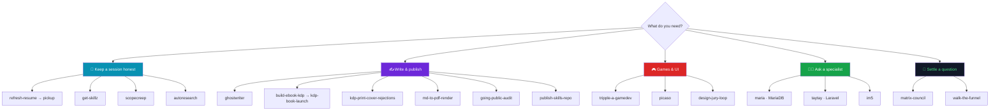

| Skill | One-liner | Trigger | Needs API key? | Loops? |
|---|---|---|---|---|
| 🔁 [`refresh-resume`](#-refresh-resume) | Harvest lessons into skills, write a handoff, then `/clear` safely | `/refresh-resume` | ❌ | ❌ |
| 🔁 [`pickup`](#-pickup) | Load the newest handoff and verify its facts before acting | `/pickup` | ❌ | ❌ |
| 🔁 [`get-skillz`](#-get-skillz) | Mine the session for durable lessons and turn them into skills | `/get-skillz` | ❌ | ❌ |
| 🔁 [`scopecreep`](#-scopecreep) | Queue a mid-task idea to `QUEUE.md` without touching it | `/scopecreep …` | ❌ | ❌ |
| 🔁 [`autoresearch`](#-autoresearch) | Modify → verify → keep or discard against any metric, unattended | `/autoresearch` | ❌ | ✅ until metric stalls |
| ✍️ [`ghostwriter`](#️-ghostwriter) | Research → write → cite-check book chapters in your voice | `/ghostwriter 15-24` | ❌ (Claude + SearXNG) | per chapter |
| ✍️ [`build-ebook-kdp`](#-build-ebook-kdp) | Manuscript + cover art → every file Amazon KDP needs, verified | `/build-ebook-kdp` | ❌ | ❌ |
| ✍️ [`kdp-book-launch`](#-kdp-book-launch) | Full launch: covers, chapter art, editorial pass, listing, social pack | `/kdp-book-launch` | ✅ image gen | phased |
| ✍️ [`kdp-print-cover-rejections`](#-kdp-print-cover-rejections) | Diagnose and fix a paperback or hardcover cover KDP keeps rejecting | "my cover got rejected" | ❌ | ❌ |
| ✍️ [`md-to-pdf-render`](#-md-to-pdf-render) | Markdown or HTML → print-quality paginated PDF on macOS | "render this to PDF" | ❌ | ❌ |
| ✍️ [`going-public-audit`](#-going-public-audit) | Sweep a repo for secrets, LAN paths, and your own name before flipping it public | `/going-public-audit` | ❌ | ❌ |
| ✍️ [`publish-skills-repo`](#-publish-skills-repo) | Curate skills out of a private library into a public repo without leaking, breaking, or misdescribing them | "add skill X to the repo" | ❌ | ❌ |
| 🎮 [`tripple-a-gamedev`](#-tripple-a-gamedev) | Consumer-persona reviewer *sees* your game, Sonnet fixes, Opus gates, repeat | `/tripple-a-gamedev 5` | ✅ OpenRouter | ✅ N cycles |
| 🎮 [`picaso`](#-picaso) | Maximalist Vue / Three.js / WebGPU interaction designer persona | `$picaso` / "Picaso" | ❌ | ❌ |
| 🎮 [`design-jury-loop`](#️-design-jury-loop) | 5 frontier models critique a live UI, dedupe, implement, ship, repeat | `/design-jury-loop 3` | ✅ OpenRouter | ✅ N rounds |
| 🧑‍🔧 [`maria`](#-maria) | MariaDB architect: types, indexes, plans, InnoDB, locks, replication, recovery | "ask Maria" | ❌ | ❌ |
| 🧑‍🔧 [`taytay`](#-taytay) | Laravel expert: Eloquent, Octane, Reverb, Redis, queues, events, Boost | "ask Taytay" | ❌ | ❌ |
| 🧑‍🔧 [`im5`](#-im5) | Explain anything in four sentences, one everyday comparison, zero jargon | `/im5 <topic>` | ❌ | ❌ |
| 🧠 [`matrix-council`](#️-matrix-council) | Six models debate + Fable chairs; every claim labelled and verified | `/matrix-council` | ✅ OpenRouter | ✅ up to ~5 rounds |
| 🧠 [`walk-the-funnel`](#-walk-the-funnel) | Trace a user's path stage by stage and measure where it actually leaks | `/walk-the-funnel` | ❌ | ❌ |

---

## 🌳 What's inside each skill

Most of these are not one command. They're small systems with modes, phases, sub-tools, and things they leave behind. This is the map. The full write-up for each one is further down.

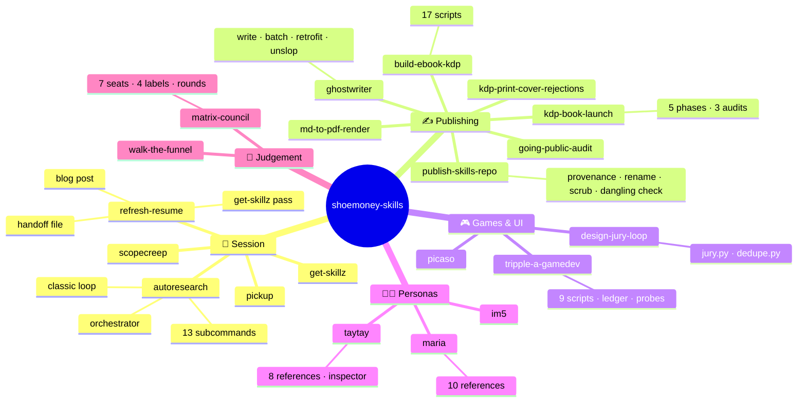

<details open>
<summary><b>🔁 Session & workflow</b></summary>

```
refresh-resume/                      "save everything, then /clear"
├── 1. get-skillz pass ──────────────▶ new or updated skills (what transfers to other projects)
├── 2. handoff file ─────────────────▶ ~/.claude/resumes/<slug>-<timestamp>-<pid>.md
│   ├── what's being worked on, host / repo / session context
│   ├── status: done (and how verified) · in progress · blocked (on whom)
│   ├── key decisions and why
│   ├── open items in priority order
│   ├── hard facts: paths, model IDs, exact commands, failure modes
│   └── the exact first command to run next time
├── 3. blog post ────────────────────▶ blog/YYYY-MM-DD-<slug>.md   (ONLY when the day TURNED)
│   ├── bar: a belief killed by measurement · a fix that broke something invisible
│   │        · a retraction · the moment the question changed
│   ├── wrong turns stay in
│   └── real numbers with sample sizes
└── pairs with ──────────────────────▶ pickup (next session)

pickup/                              "load the newest handoff, verify it, plan"
├── resolve slug: git toplevel → cwd basename → global
├── find newest resume for slug (falls back across slugs, asks which)
├── re-verify what decays fast: git log vs mtime, merged branches, closed PRs
├── trust what decays slow: paths, commands, credentials
└── summarize: status · next 2–3 actions · what was re-verified vs trusted   (never auto-executes)

get-skillz/                          "what did this session teach that transfers?"
├── durability test: would this help someone on a different project next month?
├── categories: gotchas · recurring bug patterns · house style · FAQs · optimizations
├── evidence rule: every extraction cites the exact command / error / exchange
├── routing: new skill · update existing · project memory · repo doc · drop
└── output: skill files in skill-creator format, ≤500 lines, with the TELL not just the fix

scopecreep/                          "queue it, don't chase it"
├── QUEUE.md (project) or ~/.claude/QUEUE.md
│   ├── ## Ready
│   ├── ## Blocked
│   ├── ## Notes worth keeping
│   └── ## Measured and deliberately dropped   (with the number that settled it)
├── one-line reply, then back to the task
└── hooks/scopecreep-check.sh   optional Stop hook, surfaces ready items, max once per 2h

autoresearch/                        "modify → verify → keep or discard, unattended"
├── modes
│   ├── classic: needs Metric: or Verify:, loops until the number stops improving
│   └── orchestrator: free-form goal → archetype → preset pipeline, resumable
├── subcommands: :plan :debug :fix :security :ship :scenario :predict :learn :reason :probe :improve :evals :regression
├── scripts/
│   ├── orchestrate.sh     classify · next-hop · units · plateau · screen-cmd (safety gate) · verdict
│   └── score-regression.sh  STABLE / UNSTABLE verdicts, rubric scoring
├── references/  9 goal archetypes · debate personas · author/critic/judge protocol · STRIDE+OWASP checklist
└── state: orchestrator-state.json · handoff.json per hop · *-results.tsv
```

</details>

<details open>
<summary><b>✍️ Writing & publishing</b></summary>

```
ghostwriter/                         "chapters with receipts, in the author's voice"
├── modes
│   ├── /ghostwriter 12  ·  15-24  ·  15,16,19        write chapters
│   ├── /ghostwriter BATCH: Ch. 25-40 [direction]     batch with an editorial note
│   ├── /ghostwriter retrofit 1-24                    add epigraph, hook, humor, first-person failures
│   └── /ghostwriter unslop 1-14                      cleanup pass only
├── pipeline per chapter (one Workflow, five phases)
│   ├── research   Haiku, SearXNG only
│   ├── write      Opus, voice cloned from four sample chapters
│   ├── unslop     Sonnet: em dashes → 0, banned words, AI tells
│   ├── cite-check Haiku: every claim → [RECEIPT NEEDED] or verified
│   └── patch      Opus
├── chapter shape: title · epigraph · hook · Bottom line · When it bites · The pattern
│                  · One worked example · The quiet failure · Do/don't · Where this sits · Sources
└── proof block: ls -la · wc -w ≥ 1,200 · grep -c "RECEIPT NEEDED" · grep -c "—" == 0

build-ebook-kdp/                     "book.json in, KDP upload folder out"
├── interior:  extract → typo → model → render_html (Chrome) → paginate (recto openers) → finalize (heads, folios, mirrored margins)
├── covers:    kdp_calculator (exact geometry per binding) → cover.py (front · back · spine · wrap · ebook · proof guides)
├── formats:   epub_build (epubcheck clean) · docx_build · odt_build
├── checks:    verify.py (embedded fonts, recto openers, trim, page count)
└── dist/
    ├── UPLOAD_THESE/   1_PAPERBACK · 2_HARDCOVER · 3_KINDLE_EBOOK
    ├── PROOFS/         guides with trim, safe area, spine, hinge
    ├── EDITABLE_SOURCE/
    ├── CONTENT_TO_PASTE/   one file per KDP form field
    └── scripts/ + AGENTS.md   a runnable clone for whoever maintains it next

kdp-book-launch/                     "the launch, not just the build"
├── phase 1  manuscript lock ─── editorial review (subagent) · canon audit · locked commit
├── phase 2  chapter art ──────── image gen per chapter · likeness audit (PASS/BORDERLINE/MISS) · B&W variants
├── phase 3  covers ───────────── front + back art · typography overlay · wrap PDFs
├── phase 4  build ────────────── EPUB (colour) · paperback PDF (B&W) · hardcover PDF · metadata
├── phase 5  launch prep ──────── visual companion PDF · social pack (6 platforms) · KDP listing · press release · emails
├── references/  phase checklist · KDP specs · prompt structure · cover regen troubleshooting · 3 audit methods
├── templates/   launch config · book config · 3 prompt scaffolds · editorial prompt · listing blocks
└── depends on: kdp-book-generator (third-party Node CLI) · OPENROUTER_API_KEY for image gen

kdp-print-cover-rejections/          "why KDP bounced it, measured"
├── causes: barcode zone (2.0 × 1.2 in) missing · text too close to an edge · wrong wrap size
├── measure: Ghostscript rasterize @150dpi → numpy luminance + obstruction → draw safe zones → pdfinfo
├── numbers: paperback ≥0.375 in trim / ≥0.4 in spine · hardcover ≥0.716 in · 6×9 bleed = 441×666 pt
└── traps: margin set to the exact spec floor (0.40 → 0.398 rendered) · ghost art baked into variants

md-to-pdf-render/                    "Markdown → paginated PDF, with a page budget"
├── pandoc --embed-resources → headless Chrome --print-to-pdf
├── over budget? tighten in order: line-height → font-size → margins   (never cut content first)
├── gates: ligatures in text layer · localhost links · stylesheet 404 · rasterize and look
└── print CSS that does 80%: @page size/margin · h2 break-after avoid · h3, li break-inside avoid

going-public-audit/                  "before the visibility flip"
├── 1. secrets in history, two ways:  gitleaks  +  manual blob sweep across ALL refs (incl. checkpoint refs)
├── 2. sensitive filenames ever committed · committed-then-deleted ghosts
├── 3. info disclosure: LAN IPs · internal hostnames · /Users/<you> paths · committer emails · your name in docstrings
├── 4. readiness: LICENSE · installable module path
├── 5. decide with the user: public · separate dist repo · stay private
└── 6. flip, then verify anonymously: clone · raw URL 200 · go install · installer in a clean container

publish-skills-repo/                 "the skill this vault was built with"
├── 1. provenance is a lookup: symlink target · .gitmodules · first commit · name prefix  (never an LLM guess)
│   └── portability score: one grep per skill for IPs · home paths · your domain · project paths
├── 2. renaming breaks the skill's own scripts: grep old name · sed · READ the frontmatter back
├── 3. scrubbed public copy vs installed original: pick a canonical direction, gate every commit
├── 4. a subagent's brief is a draft: grep every mechanism claim (model:, env vars) against the scripts
└── 5. repo shape: one folder per skill · dual push · name external deps · no file promised outside its folder
```

</details>

<details open>
<summary><b>🎮 Games & front-end</b></summary>

```
tripple-a-gamedev/                   "would a shopper believe a AAA studio made this?"
├── preflight (once):  kill orphan Godot · warm .godot/ import cache · baseline suite green · load .aaa/ledger.json · list rescue/* branches
├── per cycle
│   ├── capture   live_capture.gd (real play, not posed)  →  verify_shots.py (exist · no dupes · real signal · motion · fresh)
│   ├── probe     difficulty_probe.gd (headless sim, median across seeds)
│   ├── review    consumer persona SEES 13 shots + dossier   (google/gemini-3.6-flash)
│   ├── confirm   Opus: real? already fixed at HEAD or on an unmerged branch?
│   ├── plan      Opus, BATCH=2 (one visual + one behaviour target)
│   ├── implement Sonnet
│   ├── gate      Opus, closeness ≥ 85%, up to 4 tries
│   └── commit    or salvage the sound files and leave the finding open
├── scripts/  wf_aaa.js · aaa_review.py · verify_shots.py · live_capture.gd · difficulty_probe.gd
│             render_prompts.js · bench_reviewers.py · check_doc_drift.sh · test_verify_shots_freshness.py
└── leaves behind: .aaa/ (ledger, shots, pacing, calibration) · Backlog.md · rescue/* branches · one commit per passed cycle

picaso/                              "flare to 11, accessibility intact"
├── Vue: Composition API, composables, transitions
├── Three.js: materials, lighting, shaders, instancing, postprocessing
├── WebGPU: compute + render pipelines, WGSL, device loss
├── motion: particles, trails, bloom, ripples, parallax, morphing geometry
└── hard rules: decorative layers never block clicks or focus · reduced-motion respected · data-driven motion only · FPS measured, never claimed

design-jury-loop/                    "five models critique, dedupe, ship, repeat"
├── per round
│   ├── brief      brand rules · live URLs · component inventory · JSON schema with an honest stop: true
│   ├── jury.py    5 models in parallel → per-model JSON + summary.json with votes
│   ├── dedupe.py  → improve.md, agreement counts, category buckets
│   ├── decide     auto-YES at ≥2 votes, a11y, contrast, palette, trust items
│   ├── implement  fan-out by file ownership, must pass build
│   └── commit     "design-jury r$i: …" and push
├── stop: stop_votes ≥ 3 · queue empty · iteration cap
└── variants: vision jury (downscaled screenshots) · print jury (PDF → per-page PNG) · blind-ranked competing plans
```

</details>

<details open>
<summary><b>🧑‍🔧 Personas</b></summary>

```
maria/                               MariaDB architect
├── types-schema · keys-indexes · queries-optimizer · locks-ddl
├── innodb-server · logging-observability · architecture-recovery · tools-skills
├── diagnostics.sql   read-only queries for version, settings, metrics, workload
└── rules: optimize the measured workload · EXPLAIN ≠ ANALYZE · memory and concurrency together · never invent gains

taytay/                              Laravel 13 engineer
├── eloquent-database · jobs-queues · events-realtime · octane-runtime
├── redis-phpredis · boost-skills · framework-toolbox · sources
├── scripts/inspect-laravel.py   versions and mismatches from composer files, without booting the app
└── rules: baseline p50/p95/p99 first · Octane boots once, no request state in singletons · no upgrades just for a newer API

im5/                                 explain it like I'm five
├── what it's FOR, one sentence
├── one everyday comparison (kitchen, house, car, queue, mail, toys, money)
├── the one consequence that matters
└── "That's what people mean by <term>."      four sentences, hard cap
```

</details>

<details open>
<summary><b>🧠 Judgement</b></summary>

```
matrix-council/                      "settle it with evidence, not a vote"
├── seats: Neo (Fable, chair, has tools) · Morpheus · Trinity · Mouse · Tank · Seraph · Niobe (six OpenRouter models) · Operators (Haiku research)
├── labels on every claim: VERIFIED · CONTESTED · THEORY (must name its test) · UNMEASURED
├── rounds
│   ├── brief.md → round 1 opening positions (council.py)
│   ├── open_research → Operators fan out (SearXNG only) → research.md
│   ├── Neo verifies load-bearing claims himself from repo / DB / artifacts
│   ├── round 2 cross-examination with --prior and --research
│   └── more rounds until consensus, or productive deadlock with one named experiment
└── outputs: council_meetings/<slug>/verdict.html · blog/<date>-<slug>.md

walk-the-funnel/                     "be an actual stranger"
├── fresh identity: plus-aliased email, never an admin or test account
├── start where a stranger starts: follow the copy literally
├── cross every seam in-band: signup → verify email → destination → minted key → use it against prod
└── clean up: revoke, confirm the revocation took
```

</details>

---


## 📦 Install

Claude Code discovers skills in two places: **`~/.claude/skills/<name>/`** (global, every project) and **`<repo>/.claude/skills/<name>/`** (project-local). Each folder in this repo is a complete skill, so installing is just getting the folder there.

### Option A — clone once, symlink what you want (recommended ⭐)

Symlinks mean `git pull` updates every installed skill in place.

```bash
git clone https://github.com/shoemoney/shoemoney-skills.git ~/Projects/shoemoney-skills
# or from the Forgejo mirror: git clone https://git.shoemoney.ai/shoemoney/shoemoney-skills.git ~/Projects/shoemoney-skills

mkdir -p ~/.claude/skills
for s in $(ls -d */ | tr -d /); do   # or name the ones you want
  ln -sfn ~/Projects/shoemoney-skills/$s ~/.claude/skills/$s
done
```

### Option B — install all of them, globally

```bash
git clone https://github.com/shoemoney/shoemoney-skills.git ~/Projects/shoemoney-skills
ln -sfn ~/Projects/shoemoney-skills/* ~/.claude/skills/
```

### Option C — just one skill, copied, project-local

```bash
mkdir -p .claude/skills
cp -R ~/Projects/shoemoney-skills/matrix-council .claude/skills/
```

### Option D — the `~/.agents/skills` convention 🤖

If you keep skills in `~/.agents/skills/` so other agent CLIs (Codex etc.) can find them too, point the Claude symlink at that:

```bash
cp -R ~/Projects/shoemoney-skills/picaso ~/.agents/skills/picaso
ln -sfn ~/.agents/skills/picaso ~/.claude/skills/picaso
```

`picaso/agents/openai.yaml` is the metadata file that convention reads (display name, short description, default prompt).

### ✅ Verify

Start a new Claude Code session and type `/` — the skill names should autocomplete. Or ask: *"what skills do you have installed?"*

<details>
<summary>🩺 Troubleshooting</summary>

| Symptom | Fix |
|---|---|
| Skill doesn't show up | Frontmatter `name:` must match the folder name. Restart the session; skills load at start. |
| `/tripple-a-gamedev` runs but the reviewer script fails to import `or_call` | It needs the shared OpenRouter helper from the `shoop` skill at `~/.claude/skills/shoop/scripts/or_call.py`. See [Prerequisites](#-prerequisites). |
| OpenRouter calls return `"User not found"` | Stale `OPENROUTER_API_KEY` in your shell. The scripts prefer the aigate vault (`~/.claude/aigate/env`); rotate the key there. |
| Reasoning model returns empty content | `max_tokens` too low. `matrix-council` defaults to 12000 on purpose. Don't lower it. |

</details>

---

## 🔑 Prerequisites

| Requirement | Needed by | Notes |
|---|---|---|
| **Claude Code** with the `Workflow` and `Agent` tools | all | The loops fan out subagents; `ghostwriter` and `tripple-a-gamedev` dispatch a `Workflow` script. |
| **Python 3.11+** | `tripple-a-gamedev`, `design-jury-loop`, `matrix-council` | Stdlib only, except `Pillow` for screenshot verification in `tripple-a-gamedev`. |
| **Node 20+** | `tripple-a-gamedev` | `wf_aaa.js` is the Workflow script; `render_prompts.js` builds reviewer prompts. |
| **OpenRouter API key** | `tripple-a-gamedev`, `design-jury-loop`, `matrix-council` | Read from `OPENROUTER_API_KEY`, `~/.config/openrouter/key`, or the aigate vault at `~/.claude/aigate/env` (checked first). |
| **`or_call.py`** from the `shoop` skill | `tripple-a-gamedev` | Shared OpenRouter chat helper. The scripts look in `~/.claude/skills/shoop/scripts/`. |
| **SearXNG MCP server** | `ghostwriter`, `matrix-council` | All web research goes through `mcp__searxng__searxng_web_search` and `web_url_read`. Never the generic WebSearch tool. |
| **Godot 4.x** + the `godot` MCP servers | `tripple-a-gamedev` | Screenshots are captured from the real running game. |
| **Playwright MCP** | `design-jury-loop` | For screenshot briefs when running a vision jury. |
| **git** | `refresh-resume`, `design-jury-loop`, `tripple-a-gamedev`, `matrix-council` | Loops commit their own work; resume slugs come from the repo name. |
| **pandoc + headless Chrome** | `md-to-pdf-render`, `build-ebook-kdp`, `kdp-book-launch` | Every PDF in this repo is printed by Chrome. |
| **calibre, LibreOffice, epubcheck, ImageMagick, Ghostscript, poppler** | `build-ebook-kdp`, `kdp-book-launch`, `kdp-print-cover-rejections` | `brew install --cask calibre libreoffice`, `brew install epubcheck imagemagick ghostscript poppler`. |
| **kdp-book-generator** Node CLI | `kdp-book-launch` | Third-party: https://github.com/zoyth/kdp-book-generator, expected at `~/Projects/kdp-book-generator/`. |
| **gitleaks + Docker** | `going-public-audit` | Second secret scanner and a clean container for installer checks. |
| **Laravel Boost MCP** (optional) | `taytay` | Doc search and tool discovery inside a Laravel app. |
| **A mailbox you can read by API** | `walk-the-funnel` | Plus-aliased addresses give unlimited fresh identities in one inbox. |

---

## 🏗️ How a skill is built

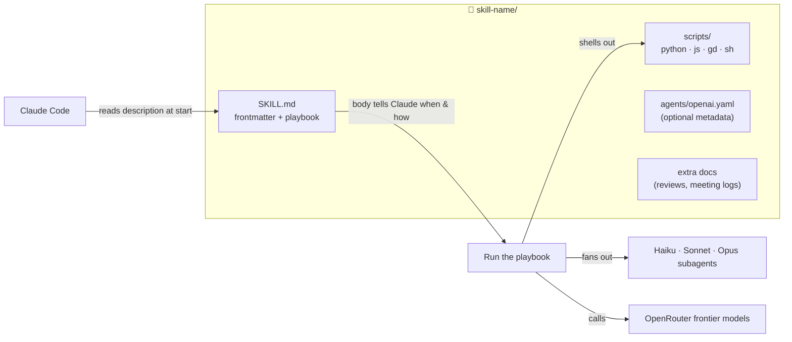

**Anatomy of the frontmatter** (the only part Claude reads before deciding to use the skill):

```yaml
---
name: matrix-council            # must match the folder name
description: >
  Convene a seven-member council ... Use when the user says "/matrix-council" ...
---
```

The `description` is doing the routing. It says what the skill does **and** every phrase that should trigger it. That's why they're long.

---

## 🎯 The skills

<br>

<div align="center">

## 🔁 Session & workflow

*Keep a session honest across clears, capture what it taught you, and let a loop grind on a metric while you sleep.*

</div>

### 🔄 refresh-resume

> **Three artifacts for three audiences before you `/clear`: skills (what transfers), a resume (what's true right now), and, rarely, a blog post (what happened and why).**

📁 `refresh-resume/` · 1 file · 121 lines

#### What it does

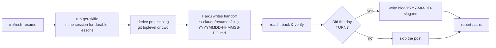

The resume file contains: what's being worked on, current status split into done / in progress / blocked, key decisions and why, open items in priority order, hard facts (paths, model IDs, exact commands, failure modes), and the exact first command to run next time.

#### How to use it

| Say | Result |
|---|---|
| `/refresh-resume` | full pass: skills + resume + maybe blog |
| "dump the context" / "save a resume so I can clear" | same |
| "write up the story so far" | the blog branch, held to the bar below |

Then `/clear`, and in the next session run **`/pickup`** (companion skill) to load the newest resume.

#### Rules baked in

- 📂 **Append-only.** Never deletes or overwrites anything in `~/.claude/resumes/`. One timestamped file per run, so parallel sessions can't collide.
- 🐚 **PID gotcha:** uses `${BASHPID:-$$}` because zsh has no `$BASHPID`. A file ending in `-.md` means the collision guard silently failed.
- 📰 **The bar for a blog post is a TURN, not activity.** A belief killed by measurement, a fix that broke something invisible, a retraction, the moment the question changed. Shipping features is not a turn. Most days don't qualify, and writing one anyway buries the days that do.
- 🔢 Posts keep the wrong turns in and use real numbers ("282x slower", "$0.03 saved").

---

### 📥 pickup

> **The other half of refresh-resume. Loads the newest handoff for this project, re-verifies the facts that decay, and hands you a plan. Never auto-executes.**

📁 `pickup/` · 1 file · pairs with `refresh-resume`

#### What it does

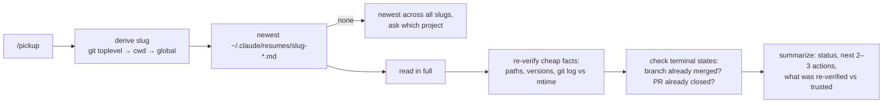

#### How to use it

| Say | Result |
|---|---|
| `/pickup` | load the newest handoff for the current repo |
| "pick up where we left off" / "continue" / "load the resume" | same |
| right after `/clear` | same, this is the whole point |

#### Rules baked in

- 🕰️ **Facts decay slower than diagnoses.** Paths, commands, and credentials mostly stay true. "The real bottleneck is X" is one session's inference and gets re-measured before anyone acts on it.
- 🔁 **A resume saying "open a PR for branch X" may already be satisfied.** It checks merged branches and open PRs before creating duplicates.
- 📄 **Repetition inside one document is one belief written twice, not corroboration.** It re-queries the number a priority rests on.
- ✋ **Does not auto-execute.** It confirms the plan with you first.

---

### 🧠 get-skillz

> **Mine the session for durable, reusable knowledge and turn it into new or updated skills before it evaporates. The reason this repo exists.**

📁 `get-skillz/` · 1 file · called by `refresh-resume`

#### What it does

1. Sweeps the whole conversation for material that passes the **durability test**: *would this help someone on a different project, next month?*
2. Sorts survivors into gotchas, recurring bug patterns, house style, FAQs, optimizations.
3. Verifies each one against the transcript. Exact commands, exact errors. Guesses get dropped.
4. Checks installed skills to avoid duplicates. Prefers updating an existing skill.
5. Routes each finding: new skill, update, project memory, repo doc, or drop.
6. Writes in `skill-creator` format, under 500 lines, and reports what it extracted and what it deliberately skipped.

#### How to use it

| Say | Result |
|---|---|
| `/get-skillz` | full extraction pass |
| "what did we learn" / "retro" / "postmortem this" / "turn this into a skill" | same |
| proactively | after an outage, a hard debugging win, a big ship, or the same mistake twice |

#### Rules baked in

- 🎯 **The durability test is the single highest-leverage decision.** A library of one-project findings pollutes every unrelated session.
- 🧾 **Every extraction cites where it came from.** Guesses become facts when written down.
- 👀 **Gotchas must include the tell**, not just the fix. "The fix is X" is only searchable once you've recognized the problem.
- ✂️ **Three sharp findings beat twenty vague ones.**
- 🚫 **Never capture project-specific paths in a global skill.** Half the lesson skills in this owner's library came out of this one.

---

### 📋 scopecreep

> **Capture an idea raised mid-task without acting on it. One line back, then straight back to work.**

📁 `scopecreep/` · 2 files · SKILL.md + optional Stop hook

#### What it does

Appends the idea to `QUEUE.md` in the project (or `~/.claude/QUEUE.md` outside a repo) with enough for a cold reader: what, in the user's words; who and when; blast radius; blockers. Files it under `## Ready` or `## Blocked`. Replies with one line. Does not start the work.

#### How to use it

| Say | Result |
|---|---|
| `/scopecreep add a dark mode toggle` | queued, one-line confirmation, back to the task |
| "we should also…" / "another thing…" / "maybe put…" mid-task | same, triggered automatically |
| Claude notices itself chasing a tangent | same |

#### Rules baked in

- 🛑 **Never starts the work.** Not even "it's only a one-liner". The queue exists because one-liners eat sessions.
- 🤐 **One line back.** No queue summary, no clarifying questions, no "while I'm here".
- 📉 **A queue that only grows becomes noise.** Settled items move to `## Measured and deliberately dropped` *with the number that settled them*, so nobody relitigates without new data.
- 🔔 Optional Stop hook ships in `scopecreep/hooks/scopecreep-check.sh`: surfaces ready items, throttled to once per two hours, always exits 0. Wiring snippet is in the skill's `SKILL.md`.

---

### 🔬 autoresearch

> **Modify → verify → keep or discard against a metric, unattended, with a bounded iteration count and a safety gate on every command.**

📁 `autoresearch/` · 7 files · 2 scripts · 4 reference docs

#### What it does

Two modes. **Classic** takes a `Metric:` or `Verify:` line and loops until the number stops improving. **Orchestrator** takes a free-form goal, classifies it into one of nine archetypes, and routes through preset subcommand pipelines with a persisted state file so a killed run can resume.

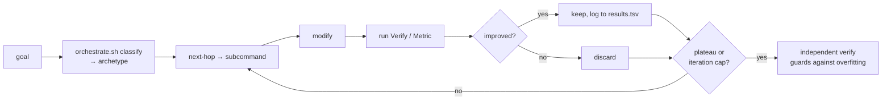

#### How to use it

| Command | Iterations | What |
|---|---|---|
| `/autoresearch` | 25 | classic loop, or orchestrator if no metric is given |
| `/autoresearch:plan` | | turn a goal into a validated Scope / Metric / Verify config |
| `/autoresearch:debug` · `:fix` · `:security` · `:probe` · `:improve` | 15 · 20 · 15 · 15 · 15 | preset archetypes |
| `/autoresearch:predict` · `:reason` · `:learn` | · 8 · 10 | multi-persona debate, adversarial refinement, learning |
| `/autoresearch:ship` · `:scenario` · `:evals` · `:regression` | | release gate, scenario runs, evals, regression scoring |

Flags: `Iterations: N` or `unlimited`, `--evals`, `--chain <targets>`, `--dry-run`, `--max-cycles N` (orchestrator, default 50), `--classic`, `--auto`.

#### Scripts and references

| File | Role |
|---|---|
| `scripts/orchestrate.sh` | Deterministic router: `classify`, `next-hop`, `units`, `plateau`, `screen-cmd` (safety gate), `verdict`, `validate-state` |
| `scripts/score-regression.sh` | `verdict <results.tsv>` → STABLE / UNSTABLE; `rubric` → `SCORE: N`. Weights via `REG_W_*` env vars |
| `references/orchestrator-routing.md` | the nine archetypes and their pipelines |
| `references/predict-personas.md` | five default and five adversarial personas for the debate mode |
| `references/reason-judge-protocol.md` | Author A → Critic → Author B → Synthesizer → Judge panel |
| `references/security-checklist.md` | STRIDE + OWASP, four red-team personas, composite metric |

#### Rules baked in

- 📌 **The predicate is pinned after round 0** and reused verbatim, so the goalposts can't drift mid-run.
- 🚫 **Never auto-approves ship, deploy, or push.**
- 🗄️ **Database URLs are allowlisted**: localhost, container hostnames, or a `_test` / `_ci` suffix. Anything else is refused.
- 🔁 **Resume re-screens every persisted command** through the safety gate before replaying it.

---

<br>

<div align="center">

## ✍️ Writing & publishing

*From first draft to a box of paperbacks, with the receipts.*

</div>

### ✍️ ghostwriter

> **Writes book chapters into `manuscript/` with verified citations, in the author's voice, and proves the file landed.**

📁 `ghostwriter/` · 1 file · 224 lines

#### What it does

Dispatches a five-phase `Workflow` per chapter. Nothing is written by one model in one pass; each phase has a different model and a different job.

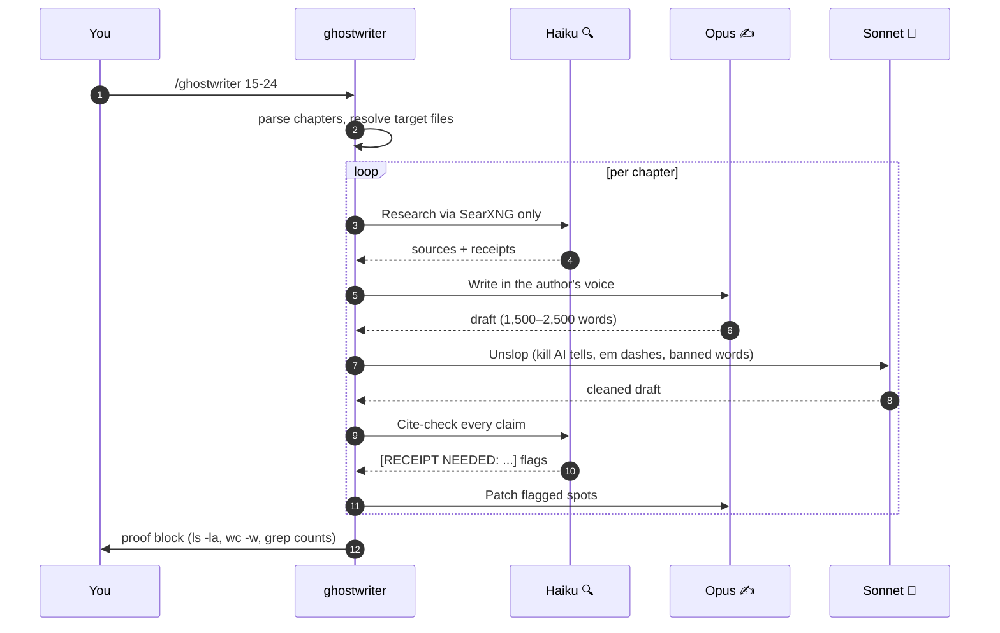

#### How to use it

| Command | Effect |
|---|---|
| `/ghostwriter Ch. 12` or `/ghostwriter 12` | one chapter |
| `/ghostwriter 15-24` or `/ghostwriter 15,16,19` | a range or list |
| `/ghostwriter BATCH: Ch. 25-40 [direction]` | batch with an editorial note |
| `/ghostwriter retrofit 1-24` | add epigraph, hook, humor, first-person failures to old chapters |
| `/ghostwriter unslop 1-14` | unslop pass only, no rewrite |

#### Guarantees it enforces

- 🚫 **Never invents sources, dates, quotes, or URLs.** Gaps are flagged `[RECEIPT NEEDED: ...]`, never filled in.
- 🚫 **Zero em dashes.** After unslop, `grep -c "—"` must return 0.
- 📏 **Proof or it didn't happen.** Success requires `ls -la`, `wc -w`, `grep -c "RECEIPT NEEDED"` output. mtime newer than the run start, at least 1,200 words, file starts with `# `.
- 🎙️ **Voice cloned from samples**, not described: bottom line first, short paragraphs, the author is the idiot in every failure story.
- 🕹️ **Era layer:** 2 to 4 references from the 1995–2005 internet per chapter, era-accurate only.

<details>
<summary>📐 Chapter structure it produces</summary>

```
# Title
> epigraph (sourced)
hook
**Bottom line:** thesis
## When it bites
## The pattern
## One worked example      ← real, dated
## The quiet failure
## Do / don't
## Where this sits in the book
## Sources and receipts    ← Verified + Gaps
```

</details>

<details>
<summary>⚙️ Paths it expects (project-specific, edit for your book)</summary>

The playbook is wired to a specific manuscript layout: a `manuscript/` target dir, `00-SPINE.md` for chapter titles, `CHAPTER-BRIEFS.md` for per-chapter briefs, and four voice-sample chapters it imitates. To reuse for another book, change those paths in `SKILL.md` and give it your own voice samples.

</details>

---

### 📚 build-ebook-kdp

> **A finished manuscript plus cover art in, every file Amazon KDP needs out: print interiors, cover wraps, EPUB, editable DOCX and ODT, and a folder that tells you exactly what to upload where.**

📁 `build-ebook-kdp/` · 23 files · 17 scripts (16 builders + kdpcfg.py) · driven by one `book.json`

#### What it does

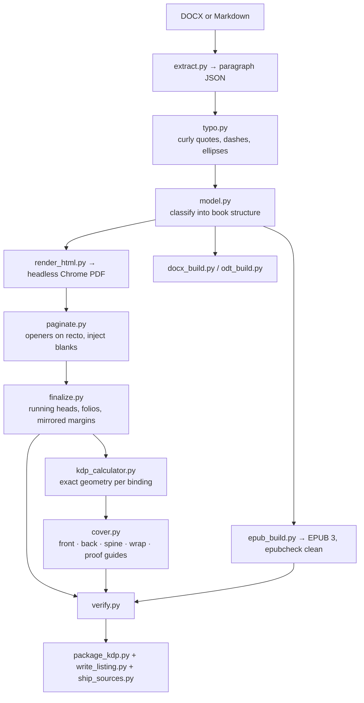

#### How to use it

| Say | Result |
|---|---|
| `/build-ebook-kdp` | full pipeline from `book.json` |
| "make my book KDP-ready" / "build the paperback interior" / "what spine width do I need" | the relevant stage |
| "convert to EPUB / ODT / Kindle" | that format only |

Env: `KDP_BOOK=path/to/book.json` (default `book.json`), `KDP_COVER_CACHE`.

#### Dependencies

Python: `python-docx`, `pypdf`, `pillow`, `reportlab`, `fonttools`, `pypdfium2`. System: Chrome or Chromium, `pandoc`, `imagemagick`, `epubcheck`, and `brew install --cask calibre libreoffice` for `ebook-convert` and `soffice`. Fonts come from Google Fonts via `fonts.py`, once per project. Shared config and KDP geometry for every script above live in `kdpcfg.py`.

#### What it leaves behind

| Folder | Contents |
|---|---|
| `dist/UPLOAD_THESE/` | `1_PAPERBACK`, `2_HARDCOVER`, `3_KINDLE_EBOOK`, each with its own README |
| `dist/PROOFS/` | cover guides with trim, safe area, spine, and hinge overlays |
| `dist/EDITABLE_SOURCE/` | DOCX and ODT with real styles and a live TOC |
| `dist/CONTENT_TO_PASTE/` | one file per KDP form field |
| `dist/scripts/` + `dist/AGENTS.md` | a runnable clone of the build and an orientation doc for whoever maintains it next |

<details>
<summary>🔬 Gotchas that cost a proof copy each</summary>

- **The print master is the PDF, not the DOCX.** They paginate differently (90 vs 100 pages on a real book). Spine width comes from the PDF page count.
- **State paper colour and page count at handover.** Cream vs white moves the spine width about 11%.
- **EPUB is what you upload.** AZW3 and MOBI are for proofing on a device only.
- **epubcheck must show 0 errors AND 0 warnings.**
- **PIL ignores EXIF rotation.** `ImageOps.exif_transpose()` first, or the cover comes out sideways.
- **Every element you move invalidates everything sized relative to it.** Re-check the neighbours.

</details>

---

### 🚀 kdp-book-launch

> **The whole launch, not just the build: editorial pass, AI chapter illustrations with a likeness audit, generated covers, EPUB and print PDFs, visual companion, social pack, listing copy.**

📁 `kdp-book-launch/` · 32 files · 12 scripts · 7 reference docs · 7 templates

#### What it does

Five phases, each gated before the next.

| Phase | What happens | Cost |
|---|---|---|
| 1. Manuscript lock | editorial read by a subagent, optional canon audit, locked commit | |
| 2. Chapter illustrations | image generation per chapter, likeness audit, B&W variants for print | about $0.14 per image, $20 hard cap |
| 3. Cover production | front and back art generated, typography overlaid in a vector editor, wrap PDFs | |
| 4. Build | EPUB with embedded colour images, paperback and hardcover PDFs in B&W, metadata | |
| 5. Launch prep | visual companion PDF, social pack for six platforms, KDP listing, press release, emails | |

#### How to use it

| Say | Result |
|---|---|
| "launch a book on KDP" | all five phases |
| "generate chapter illustrations" / "make a book cover" / "build the social pack" / "write the KDP listing" | that phase |

#### Dependencies

- Python: `pypdf`, `PIL`. System: `pandoc`, `imagemagick`, `epubcheck`, headless Chrome.
- **The `kdp-book-generator` Node CLI**, expected at `~/Projects/kdp-book-generator/`. It's a third-party tool: https://github.com/zoyth/kdp-book-generator
- `OPENROUTER_API_KEY` for image generation through OpenRouter.

#### Scripts

| Script | Role |
|---|---|
| `generate_chapter_images.py` · `generate_front_cover.py` · `generate_back_cover.py` | image generation, idempotent, three retries per slug |
| `make_bw_variants.py` | colour → grayscale for print |
| `build_book_md.py` | manuscript → kdp-book-generator input |
| `epub_embed_images.py` · `build_print_pdf.py` · `compose_cover_wrap.py` | the build stage |
| `build_visual_companion.py` · `build_social_pack.py` | launch collateral |
| `postprocess.py` · `_config.py` | PDF metadata, shared config loader |

<details>
<summary>📚 Reference docs and templates</summary>

References cover the phase checklist, KDP trim and spine specs, a six-block prompt structure for chapter art (subject, scene, lighting, composition, negative, style), cover regeneration troubleshooting, a likeness-audit method (PASS / BORDERLINE / MISS per chapter), a canon audit for family and religion facts, and the editorial review method. Templates give you the launch config, book config, prompt scaffolds, the editorial subagent prompt, and the KDP listing blocks.

**Gotchas:** the model adds hair to a bald subject → `use_strong_refs: true` and regenerate with `--force`. Text appears in the image → strengthen the negative block. `OPF-014: Image not found` → re-run `epub_embed_images.py`.

</details>

---

### 🚫 kdp-print-cover-rejections

> **Why KDP keeps bouncing your paperback or hardcover cover, and how to measure the fix before you upload again.**

📁 `kdp-print-cover-rejections/` · 1 file

#### What it does

Reads the rejection email, names the cause (a missing 2.0 × 1.2 inch barcode zone, or text too close to an edge), then **measures the cover instead of eyeballing it**: rasterize with Ghostscript at 150 dpi, check barcode-zone luminance and obstruction with numpy, draw the safe zones onto a PNG, confirm geometry with `pdfinfo`.

#### How to use it

| Say | Result |
|---|---|
| "my cover got rejected again" / "We are unable to place a barcode on your file" / "text is too close to the edges" | diagnosis and a measured fix |
| before uploading any print cover | the pre-flight check |

#### The numbers

| Thing | Value |
|---|---|
| Barcode zone | 2.0 × 1.2 in, inset 0.25 in from the back panel's bottom-right |
| Paperback text safe distance | ≥ 0.375 in from trim, ≥ 0.4 in from spine |
| Hardcover text safe distance | ≥ 0.716 in from outer edges |
| 6×9 with bleed | page must be 441 × 666 pt |
| Paperback spine | pages × 0.0025 in (cream) or 0.002252 in (white) |
| Hardcover wrap | use the KDP Cover Calculator, not a formula |

#### Rules baked in

- 📏 **Never set a margin constant to exactly the spec floor.** 0.40 in rendered at 0.398 in after antialiasing. Eight rejections. Use 0.55 and remeasure the rendered output.
- 👻 **Ghost copy survives OCR and geometry checks.** Old art baked into a variant file passes every test and still ships the wrong cover. Pin art by SHA-256 and delete fallback variants.
- 📮 **The rejection email says "your title" meaning the listing, not the book name.** Authors miss this for months.
- 🔢 Every format needs its own ISBN.

---

### 🖨️ md-to-pdf-render

> **Markdown or HTML to a print-quality, paginated PDF on macOS with pandoc and headless Chrome, with a page budget and a check that the text layer isn't silently corrupt.**

📁 `md-to-pdf-render/` · 1 file · macOS by design

#### What it does

1. pandoc converts Markdown to HTML with `--embed-resources`.
2. Headless Chrome prints it with `--print-to-pdf --no-pdf-header-footer`.
3. Counts pages. Over budget? Tighten in order: line-height, then font-size, then margins. Never cut content first.
4. Checks the built PDF for ligature glyphs, dead localhost links, and a stylesheet that silently 404'd.
5. Rasterizes and looks at it before declaring done.

#### How to use it

| Say | Result |
|---|---|
| "render this to PDF, two pages max" | build with a page budget |
| resumes, one-pagers, reports, anything that regenerates from a text source | same |
| "here's a PDF, edit it" | it offers to rebuild from Markdown instead |

#### Rules baked in

- 🔤 **Ligatures corrupt the text layer.** Chrome turns `fi` into U+FB01. Looks perfect, searches wrong, breaks ATS parsers. Fix with `font-variant-ligatures: none`, verify with `pdftotext … | grep '[fiflffffiffl]'`, make it a build gate.
- 📐 **Print CSS that handles most of it:** `@page { size: letter; margin: 0.5in 0.55in }`, `h2 { page-break-after: avoid }`, `h3, li { page-break-inside: avoid }`.
- 🔗 **Link annotations resolve against the page origin.** Render from localhost and every link dies when emailed. Use `--host-resolver-rules` to render against the production hostname.
- 🎨 **A 404'd stylesheet gives an unstyled PDF, not an error.** Gate on the stylesheet returning 200 and fail on suspiciously small output.
- 🖼️ **Verify by rasterizing, not text extraction.** Subsetted mono fonts can drop the digits from numbered lists.

---

### 🔓 going-public-audit

> **Run before flipping any private repo public. Two independent secret scans of the full history, an info-disclosure sweep, a readiness check, and an anonymous verification after the flip.**

📁 `going-public-audit/` · 1 file · the skill this repo was audited with

#### What it does

1. **Secrets in history, two ways.** `gitleaks detect` plus a manual blob sweep for private keys, AWS, GitHub, Slack, and Google token shapes.
2. **Sensitive filenames ever committed**, including committed-then-deleted ghosts.
3. **Info disclosure**, not secrets: LAN and Tailscale IPs, internal hostnames, absolute home paths, committer emails, your own name in docstrings. Surfaced, never silently scrubbed.
4. **Readiness:** LICENSE present, module path installable from the public mirror.
5. **Decide with the user:** go public, publish a separate dist repo, or stay private.
6. **Flip and verify anonymously:** anonymous clone, raw URL returns 200, `go install` builds, installers run in a clean container.

#### How to use it

| Say | Result |
|---|---|
| `/going-public-audit` | the full pass |
| "make this repo public" / "open-source this" / "is it safe to make X public" / "any secrets exposed" | same |

Needs `gitleaks`, `git`, `gh`, `curl`, and Docker for installer checks.

#### Rules baked in

- 🕳️ **"It was never committed" is false comfort.** Measured 2026-08-19: a live API key in an untracked file, never `git add`ed, was sitting in two Claude Code checkpoint refs under `refs/t3/checkpoints/`. `git log -- <path>` showed nothing. `git log --all -- <path>` found it. Never narrow `--all` to `--branches --tags`.
- 🗑️ **Deleting the file does not scrub it.** For a sanitized public copy, don't carry the history at all: copy, `rm -rf .git`, one clean commit.
- 📖 **A README overclaim is its own leak.** If a table says a control is enforced, open the code and confirm before publishing.
- ✋ **Never filter-repo, force-push, or flip without an explicit yes.** The flip is the last step.

---

### 📦 publish-skills-repo

> **Curate skills out of a private Claude Code library into a public repo without leaking, breaking, or misdescribing them. This vault was built with it.**

📁 `publish-skills-repo/` · 1 file · five scars, each one measured while building this repo

#### What it does

1. **Provenance is a lookup, not a judgement call.** Symlink target, `.gitmodules`, first commit, name prefix. A model asked to sort 325 skills filed the author's own `get-skillz` as third-party; one shell loop got it right.
2. **Portability score** per skill: one grep for LAN IPs, home paths, your domain, project paths. Zero means ship as-is.
3. **Renaming a skill breaks its own scripts.** They hardcode `~/.claude/skills/<old-name>/…` as defaults. Grep, sed, then *read the frontmatter back*.
4. **A scrubbed public copy and the installed original are two files.** Pick the canonical direction and run the portability gate on every commit, not just the first.
5. **A subagent's brief is a draft.** Grep every mechanism claim (`model:` assignments, env vars) against the scripts before it becomes README text.
6. **Nothing promised outside the folder.** A dangling-reference check catches a SKILL.md that names a hook or script the repo does not ship.

#### How to use it

| Say | Result |
|---|---|
| "add skill X to the repo" / "put my skills in a repo" / "open-source my skills" | the full pass on that skill |
| "which skills did I write" / "which should I open-source" | the mechanical provenance sweep plus a portability score |
| "rename skill X to Y" | rename with the self-path fix and the frontmatter read-back |

Needs `git`, `grep`, `readlink`, `stat`. The `stat -f` and `sed -i ''` forms are BSD/macOS; swap for GNU on Linux.

#### Rules baked in

- 🔍 **Batches of skills sharing one mtime with no author marker are installed packs, not authored.** Label them unverified, don't guess either way.
- 🔁 **The next `rsync` from the installed copy puts the leak back**, and the commit looks routine. The gate runs on updates.
- 📝 **Prefer placeholders that keep the shape** (`<deploy-host>:<deploy-path>/app`, `192.168.x.x`) over deleting the line.
- 🪝 **A skill that points at a file outside its own folder ships a broken promise.** Vendor it in, rewrite the path, leave the installed original alone.

---

<br>

<div align="center">

## 🎮 Games & front-end

*Loops with an outside judge.*

</div>

### 🎮 tripple-a-gamedev

> **"Would a shopper believe a AAA studio made this?" A consumer-persona reviewer looks at real screenshots of your Godot game, names the giveaways, Opus fixes them, a gate checks the fix, repeat N times.**

📁 `tripple-a-gamedev/` · 12 files · 1,821-line playbook · 9 scripts

#### What it does

The game is judged **for its kind**: a 2D action game is measured against Dead Cells, not Call of Duty. The reviewer is a multimodal model that *sees* verified real captures, never a blank frame.

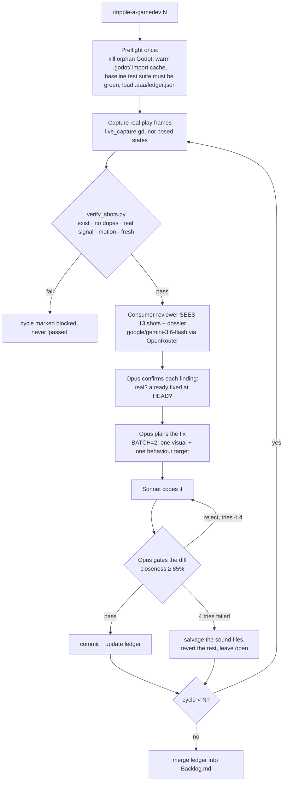

Every cycle also runs `difficulty_probe.gd`, a headless sim stepper (about 7,000 ticks/s) that reports pacing as a **median** across seeds, so one pathological seed can't skew the verdict.

#### How to use it

| Command | Effect |
|---|---|
| `/tripple-a-gamedev` | one cycle |
| `/tripple-a-gamedev 5` | five cycles |
| `/aaa-game 3` | alias |
| "what gives away that this isn't AAA?" | one review, no fix loop |

Workflow args (when dispatching `wf_aaa.js` directly): `root` (Godot project, required), `cycles` (1), `batch` (2), `live` (true), `godot` (defaults to the macOS app binary), `reviewModel` (defaults to the script's `google/gemini-3.6-flash`), `maxTries` (4).

⏱️ **Budget honestly.** A measured `/tripple-a-gamedev 5` run took **21.5 hours wall-clock** (88 agents, 0 errors, 5/5 cycles landed). One cycle is about 4.3 hours: review 25s, plan 2m, code 8 to 15m, gate 15m, and about 45m of capture and repro. Twenty cycles is 12 to 20 hours of unattended work, not an evening. Run it under `/loop` or overnight, and **never run two workflows on the same project root**: both commit, and either's reject path erases the other.

#### What it leaves behind

| Path | What |
|---|---|
| `ROOT/.aaa/` (gitignored) | `ledger.json` (backlog, shipped, dismissed, owner decisions), `shots/`, `pacing.json`, `calibration.json` |
| `ROOT/Backlog.md` | Human-readable merge of the ledger across runs. Shipped items marked RESOLVED with the sha. Owner decisions kept verbatim. |
| `rescue/*` branches | Stash snapshots taken before any destructive reset in the reject path. Preflight lists unmerged ones. |
| one git commit per passed cycle | subject is the giveaway title, body is severity and why |

#### Scripts

| Script | Role |
|---|---|
| `wf_aaa.js` | The `Workflow` script. Orchestrates capture → review → fix → gate per cycle. |
| `aaa_review.py` | Sends verified screenshots + persona prompt to the reviewer model. Standalone runnable. |
| `verify_shots.py` | Proves captures are real, fresh, and non-blank before any model sees them. |
| `test_verify_shots_freshness.py` | Tests for the above, so the guard can't silently rot. |
| `live_capture.gd` | Godot-side capture hook that grabs frames from the running game. |
| `difficulty_probe.gd` | Difficulty telemetry: too easy / too hard / about right. |
| `render_prompts.js` | Builds the reviewer and fixer prompts from templates. |
| `bench_reviewers.py` | Benchmarks candidate reviewer models against each other. |
| `check_doc_drift.sh` | Fails if the playbook and the scripts disagree. |

<details>
<summary>🔬 Hard-won gotchas (each one cost a run)</summary>

- **BATCH stays at 2.** Wider batches tanked gate accept rates (55 to 68% vs 93%) and disabled file-level salvage. Narrower ones starved the behaviour lens and the visual findings got rediscovered forever.
- **A warm but stale `.godot/` cache reviews old pixels.** After any `assets/` merge or worktree copy, re-run `--import`, or the cycle judges artwork that isn't on disk.
- **The ledger rides in the prompt every cycle and grows without bound.** It's capped at serialization (details to 400 chars, entries older than 3 cycles replaced with a pointer to `Backlog.md`). Titles are never truncated because they're the dedupe key. Measured: 169 KB at cycle 6 → 48 KB after the cap.
- **Safe to stop between cycles only.** A mid-cycle kill strands gate findings in the workflow journal. Merge them into the ledger before relaunching.
- **`already_fixed` only sees HEAD.** A fix sitting on an unmerged branch is invisible, so preflight lists unmerged branches by subject and Confirm can search them.
- **Commits are verified by side effect.** HEAD is snapshotted before and after; no movement or dirty files means fail, not "probably fine".
- **Pick the reviewer with `bench_reviewers.py`, not vibes.** Grok was faster but misread pixel fonts; gemini-3.6-flash was 5/5 on the hard set.
- **`check_doc_drift.sh` runs at preflight** and fails the run if the playbook's claims (motion gate, reviewer slug, probe path) disagree with the scripts.

</details>

<details>
<summary>📚 Extra docs in the folder</summary>

`REVIEW-2026-07-26.md` and `REVIEW-2026-07-26-addendum-capture-integrity.md` are the adversarial reviews that shaped the capture-integrity guard. They're kept because the *why* is the useful part.

</details>

---

### 🎨 picaso

> **A JavaScript reactivity and interaction designer whose default intensity is 11/10. Vue.js, Three.js, WebGPU. Ask for flare, get flare.**

📁 `picaso/` · 2 files · persona skill, no scripts

#### What it does

Picaso is a **persona**, not a pipeline. Invoke it and Claude becomes a maximalist front-end designer who ships the build, not a mood board.

| Domain | What Picaso reaches for |
|---|---|
| **Vue.js** | Composition API, composables, refs, computed, watchers, lifecycle, transitions |
| **Three.js** | scene composition, materials, lighting, shader effects, instancing, postprocessing |
| **WebGPU** | compute and render pipelines, WGSL, device-loss handling |
| **Motion** | particles, trails, distortion, bloom, ripples, parallax, dimensional typography, reactive lighting, morphing geometry |
| **Performance** | instancing, batching, reusable buffers, bounded particle pools, adaptive resolution, DPR handling |

#### How to use it

| Say | Result |
|---|---|
| "Picaso, give this dashboard ridiculous flare" | maximalist pass on that surface |
| `$picaso` (Codex-style) | same persona via `agents/openai.yaml` |
| "turn these interactions up to 11" | same |
| "…but keep it subtle" | you must explicitly ask for less; 11 is the default |

#### Non-negotiables it enforces

- ♿ **Accessibility survives the flare.** Decorative layers never intercept clicks, hide focus, or corrupt layout. Keyboard and touch keep working. `prefers-reduced-motion` is respected.
- 📊 **Motion that represents data is wired to real data.** No fake progress bars, no invented metrics.
- 🎯 **Scope stays put.** "Flare up this one component" authorizes an extravagant component, not an app rewrite.
- 📈 **Frame rates are measured, never claimed.** Interactions are actually triggered (hover, focus, scroll, click, route change) before reporting done.

---

### ⚖️ design-jury-loop

> **Five frontier models critique a live UI or brand surface, findings are deduped into `improve.md`, the agreed items get implemented and shipped, then the jury looks again. Repeat until they vote to stop.**

📁 `design-jury-loop/` · 3 files · 621-line playbook · 2 scripts

#### What it does

```mermaid
sequenceDiagram
    autonumber
    participant Y as You
    participant L as design-jury-loop
    participant J as jury.py (5 models ∥)
    participant D as dedupe.py
    participant W as Implement (∥ agents)
    Y->>L: /design-jury-loop 3
    loop round i = 1..N
        L->>L: write brief: brand rules, live URLs, inventory, JSON schema
        L->>J: fan out to 5 models via OpenRouter
        J-->>L: per-model JSON + summary.json (votes)
        L->>D: merge into improve.md, count agreement
        L->>L: auto-YES ≥2 votes, a11y, contrast, palette, trust items
        L->>W: fan out by file ownership; must pass build
        W-->>L: done
        L->>L: git commit "design-jury r$i: …" && push
        L->>L: stop if stop_votes ≥ 3, or queue empty, or i == N
    end
```

#### How to use it

| Say | Iterations |
|---|---|
| `/design-jury-loop` | 3 (default) |
| `/design-jury-loop 5` | 5 |
| "jury loop 2 rounds" | 2 |
| "design jury until clean" | up to 5, stops early on 3 stop-votes |

#### Scripts

| Script | CLI |
|---|---|
| `jury.py` | `jury.py <brief.txt> [--models m1,m2,…] [--out-dir DIR] [--timeout 240] [--max-tokens 6000]` — parallel OpenRouter calls, per-model JSON, `summary.json` with vote counts |
| `dedupe.py` | `dedupe.py <summary.json> <improve.md> [--round N]` — merges findings, buckets by general / transitions / professional / font, counts agreement |

**Default jury:** `anthropic/claude-opus-5` · `openai/gpt-5.6-sol` · `google/gemini-3.7-flash` · `x-ai/grok-4.6` · `deepseek/deepseek-v4-flash`. Override with `--models`.

<details>
<summary>🔬 Hard-won gotchas (measured 2026-08-27)</summary>

- **Round 1 always scores zero stop votes.** Plan for it. Never present R1 as done.
- **Re-jury only the deployed state.** If you jury the local tree, models re-report last round's findings as if nothing shipped. Verify the asset hash moved first.
- **Reasoning models return `content: null`.** Fall back to the `reasoning` field and budget 3000+ tokens.
- **Honest-stop framing works.** The brief must say `stop: true` is expected, respected, and legitimate. Omitting it produced 0/45 stop votes in R1.
- **Vision juries:** downscale to ≤1100×2200 JPEG q78 before base64. Expect training-cutoff false positives about dates. Scroll incrementally; `fullPage` captures skip scroll timelines.
- **Print juries:** HTML → Chrome `--headless=new --print-to-pdf` → `pdftoppm -png -r 110` → per-page PNGs.
- **Plateau while the owner hates it?** The brief's "do not reopen" rule is the culprit. Unlock it and ask for a diagnosis of the gap first.

</details>

---

<br>

<div align="center">

## 🧑‍🔧 Personas

*Specialists you address by name.*

</div>

### 🐬 maria

> **A MariaDB architect who optimizes the measured workload, not the label on it. Types, keys, plans, locks, InnoDB, logging, replication, recovery.**

📁 `maria/` · 12 files · 9 reference docs · a read-only diagnostics SQL file

#### What she covers

| Area | Reference |
|---|---|
| Types and schema: integers, decimals, time, strings, JSON, UUIDs, charsets, collation | `types-schema.md` |
| Primary, foreign, unique, composite, covering, prefix indexes, partitioning | `keys-indexes.md` |
| `EXPLAIN` vs `ANALYZE`, join order, statistics, filesort | `queries-optimizer.md` |
| Isolation levels, metadata locks, deadlocks, online and atomic DDL | `locks-ddl.md` |
| Buffer pool, redo log, I/O capacity, concurrency | `innodb-server.md` |
| Error, slow, general, and binary logs, Performance Schema | `logging-observability.md` |
| Replication, Galera, sharding, durability, backups, recovery | `architecture-recovery.md` |
| Read-only queries for version, settings, metrics, workload | `diagnostics.sql` |
| Research and source map behind every claim in the guides above | `sources.md` |

#### How to use it

| Say | Result |
|---|---|
| "ask Maria why this query is slow" / `$maria` | she reads the plan and the workload before suggesting anything |
| any substantial MariaDB design, index, or tuning question | same |

#### Rules baked in

- 📊 **Optimize the measured workload, not the label.** No index gets added to a table nobody has profiled.
- 🔬 **`EXPLAIN` estimates. `ANALYZE` executes.** She keeps them separate.
- 🧠 **Memory and concurrency get tuned together**, never one without the other.
- 🛡️ **Durability is required behaviour, not a setting to trade for speed.**
- 🚫 **Never invents gains.** A number she didn't measure doesn't go in the report.

---

### 🎸 taytay

> **A Laravel engineer for the parts that hurt in production: Eloquent and N+1, queues and Horizon, events and Reverb, Octane workers, Redis and PhpRedis. Laravel 13 baseline, version-checked before advising.**

📁 `taytay/` · 11 files · 8 reference docs · 1 script

#### What she covers

| Area | Reference |
|---|---|
| Relationships, eager loading, N+1, transactions, locks, upserts, pagination | `eloquent-database.md` |
| Durable queues, retries and backoff, uniqueness, batches, chains, Horizon | `jobs-queues.md` |
| Events, notifications, broadcasting, Reverb, private channels, Echo | `events-realtime.md` |
| Worker lifetime, memory leaks, FrankenPHP, RoadRunner, Swoole, Pulse | `octane-runtime.md` |
| PhpRedis extension, serializers, cluster slots, Pub/Sub, Streams, eviction | `redis-phpredis.md` |
| Laravel Boost MCP: tool discovery, skill authoring, doc search | `boost-skills.md` |
| Traits, observers, scheduling, HTTP client, timeouts, retries | `framework-toolbox.md` |

`scripts/inspect-laravel.py <root>` reads `composer.json`, `composer.lock`, and `vendor/composer/installed.json` **without booting the app or touching `.env`**, and prints the installed Laravel, PHP, database, and Redis versions plus any declared-vs-installed mismatches.

#### How to use it

| Say | Result |
|---|---|
| "ask Taytay about this queue" / `$taytay` | she inspects the app, checks versions, then implements a tested change |
| any substantial Laravel engineering | same |

#### Rules baked in

- 📈 **Baseline before optimizing:** p50 / p95 / p99, query count and time, rows examined, memory.
- 🧍 **Octane boots once.** No singletons holding request or user state. Octane tables and cache are local, not distributed.
- 🔌 **PhpRedis serializers are runtime-specific.** She checks which extension is actually loaded.
- 📦 **Does not upgrade packages just to get a newer API.**

---

### 🧒 im5

> **Explain the thing as if the reader is five. Four sentences, hard cap. One everyday comparison. Zero jargon. First word is the answer.**

📁 `im5/` · 1 file · persona skill, no scripts, no keys

#### What it does

The opposite of the other six. No fan-out, no loop, no models arguing. It takes a topic and answers with what the thing is **for** before what it **is**, using a comparison from a kitchen, a house, a car, a queue, mail, toys, or money.

```
<What it's for, one sentence.>
<The comparison, one or two sentences.>
<The one consequence that matters.>
That's what people mean by <term>.
```

#### How to use it

| Say | Result |
|---|---|
| `/im5 a load balancer` | the restaurant host who seats each group at whichever table is free |
| "explain DNS like I'm 5" | the phone book that turns "the pizza place" into a street address |
| "dumb it down" / "in plain English" / "what does that actually mean" | same skill, topic is whatever you named |

#### Rules it enforces

- 🔢 **Four sentences, hard cap.** Two or three is usually better. Needing more means the comparison is wrong, not that the topic is big.
- 🚫 **No jargon, no acronyms.** If a term is the whole point, plain version first, then name it once at the end.
- 🚫 **No hedging.** No "essentially", "basically", "sort of", "you can think of it as".
- 🚫 **No preamble.** Never restates the question.
- 😶 **One emoji max**, at the end, and usually none.
- 🎯 If the honest answer needs detail, it gives the five-year-old version first and then offers *"Want the real version?"*

---

<br>

<div align="center">

## 🧠 Judgement

*When the argument needs evidence, or the product needs a stranger.*

</div>

### 🕶️ matrix-council

> **Seven engineers settle a hard question with evidence: six frontier models debate over OpenRouter, Fable chairs as Neo with tool access, Haiku Operators fetch what nobody knows first-hand. Every claim is labelled. Theories must ship their own test. Members retract on proof.**

📁 `matrix-council/` · 3 files · 225-line playbook · 1 script

#### The seat map

| Seat | Model | Role |
|---|---|---|
| 🕶️ **Neo** (chair) | Fable, in this harness | Verifies independently from repo, DB, and artifacts. Casting vote requires evidence. |
| Morpheus | `openai/gpt-5.6-luna-pro` | member |
| Trinity | `google/gemini-3.6-flash` | member |
| Mouse | `x-ai/grok-4.5` | member |
| Tank | `deepseek/deepseek-v4-flash` | member |
| Seraph | `moonshotai/kimi-k3` | member |
| Niobe | `qwen/qwen3.8-max` | member (can starve on heavy briefs; treat as absent, not as a vote) |
| 📡 **Operators** | Haiku subagents | research on demand, SearXNG only |

#### Claim labels

| Label | Meaning |
|---|---|
| ✅ `VERIFIED` | evidence attached, chair re-checked it |
| ⚔️ `CONTESTED` | members disagree, evidence on both sides |
| 💭 `THEORY` | allowed, **but must name the test that would settle it** |
| 📏 `UNMEASURED` | nobody has the number yet |

#### How a session runs

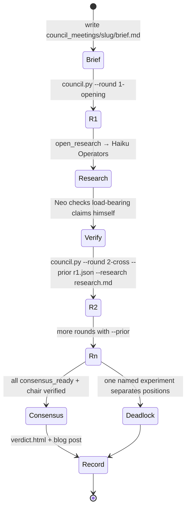

#### How to use it

| Say | Result |
|---|---|
| `/matrix-council` | convene on the question at hand |
| "convene the council" / "ask the council" / "council of SWE" | same |

```bash
python3 scripts/council.py <brief.md> --round <name> --out-dir council_meetings/<slug> \
  [--members <list>] [--prior <json>] [--research <md>] [--max-tokens 12000]
```

#### Outputs

- 📄 `council_meetings/<slug>/verdict.html` — self-contained meeting record: claims table, retractions, dissent, still-open items, per-member positions, chair's independent verification.
- 📰 `blog/<YYYY-MM-DD>-<slug>.md` — narrative for humans, wrong turns included, real numbers with sample sizes.

<details>
<summary>⚠️ Rules that make it work</summary>

- **`--max-tokens 12000` is measured, not arbitrary.** Reasoning models spend the budget thinking *before* emitting content. Lower it and they return empty at `finish_reason=length`. This is the number one failure.
- **Unanimous consensus without chair verification is a poll, not proof.** Neo must independently check every load-bearing `VERIFIED` claim.
- **Casting vote requires evidence.** If the chair can't break a tie with repo or DB findings, declare productive deadlock and name the experiment.
- **Cap at about 5 rounds.** Unconverged after that means the question was underspecified.

</details>

---

### 🚶 walk-the-funnel

> **Be an actual stranger. Sign up with a fresh aliased email, read the inbox by API, click the real link, use the artifact it produced against the real service. Systems fail at the seams between correct components.**

📁 `walk-the-funnel/` · 1 file

#### What it does

1. **Be a stranger.** Fresh account with a plus-aliased email (`you+probe1@domain`), so every probe is a new identity that still lands in one inbox you can read programmatically. Never an admin or test account, because allowlists hide gates.
2. **Start where a stranger starts.** Read the error message, the ad, or the README verbatim and follow it literally. Every link, every "go to X", every claimed default.
3. **Cross every seam in-band.** Browser signup → verification email → the destination page → the key or session it minted → actually use that key against production.
4. **Clean up.** Revoke the probe token and confirm the revocation took.

#### How to use it

| Say | Result |
|---|---|
| `/walk-the-funnel` | walk the current product's signup or onboarding end to end |
| after shipping an auth gate, email verification, key minting, a payment path, or a public→auth or free→paid flip | same |

#### The founding story

Every piece of a new API auth gate was individually verified: middleware tests, live curl checks of the 401 and 200 paths, an adversarial review. The funnel was still broken end to end. The 401 message sent new users to a token page that an older members-only gate 403'd. No component owned the whole path, so no component test could fail on it. **Found in four minutes of walking.**

#### Rules baked in

- 🧱 **Gates from earlier policy eras keep standing across new funnels.** Copy drifts to pages, flags, and prices that no longer exist.
- 🧪 **Convert the walked path into a feature test where you can**, and know its limits: in-repo tests can't see nginx, cached responses, or DNS.
- 🔁 **Re-walk after any copy or gate change.** Four minutes is cheaper than a silent 100% conversion failure.

---

## 🔗 Shared patterns

These skills rhyme on purpose.

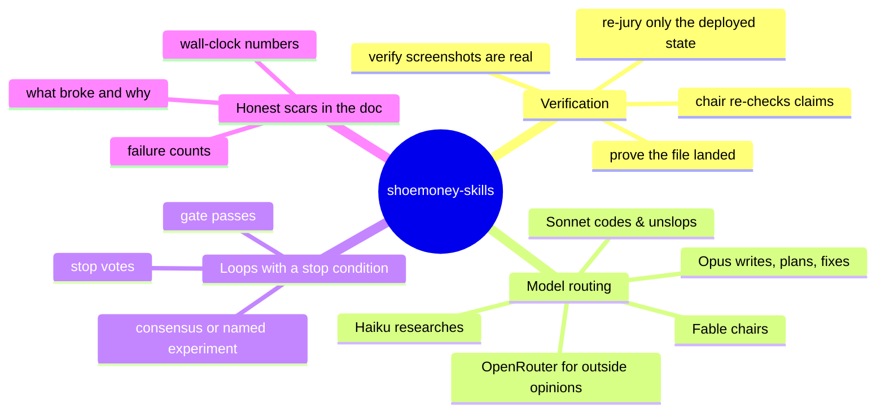

| Pattern | Where |
|---|---|
| **Web research goes through SearXNG MCP only** | ghostwriter, matrix-council |
| **OpenRouter key from the aigate vault first, env second** | tripple-a-gamedev, design-jury-loop, matrix-council |
| **JSON out of models, extracted defensively** | jury.py, council.py, aaa_review.py |
| **Never claim done without shell proof** | ghostwriter, refresh-resume, tripple-a-gamedev, picaso |
| **Say what it is FOR before what it IS** | im5, and every skill description in this repo |
| **Commit after each round** | design-jury-loop, tripple-a-gamedev |
| **Measure, don't eyeball** | kdp-print-cover-rejections, md-to-pdf-render, maria, taytay, autoresearch |
| **Be a stranger to your own system** | walk-the-funnel, going-public-audit, publish-skills-repo, tripple-a-gamedev |

---

## 🖥️ Cross-platform

| | macOS 🍎 | Linux 🐧 | Windows 🪟 |
|---|---|---|---|
| ghostwriter | ✅ | ✅ | ✅ |
| refresh-resume | ✅ (zsh PID fallback built in) | ✅ | ⚠️ needs a POSIX shell |
| tripple-a-gamedev | ✅ used here | ✅ should work | ❓ untested (Godot capture hooks are engine-side, so likely fine) |
| picaso | ✅ | ✅ | ✅ |
| design-jury-loop | ✅ used here | ✅ | ⚠️ print-jury pipeline assumes `pdftoppm` |
| matrix-council | ✅ used here | ✅ | ✅ (python3 only) |
| im5 | ✅ | ✅ | ✅ |
| pickup / get-skillz / scopecreep | ✅ | ✅ | ⚠️ POSIX shell |
| autoresearch | ✅ used here | ✅ | ⚠️ bash scripts |
| build-ebook-kdp | ✅ used here | ✅ | ❓ untested |
| kdp-book-launch | ✅ used here | ✅ | ❓ untested |
| kdp-print-cover-rejections | ✅ | ✅ | ✅ (advice + ImageMagick) |
| md-to-pdf-render | ✅ macOS only by design | ⚠️ swap the Chrome path | ❌ |
| going-public-audit / walk-the-funnel | ✅ | ✅ | ✅ |
| publish-skills-repo | ✅ used here | ⚠️ `stat -f` and `sed -i ''` are BSD forms | ⚠️ POSIX shell |
| maria / taytay | ✅ | ✅ | ✅ |

---

## 🛣️ Roadmap

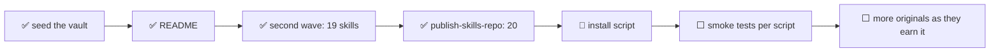

| Status | Item |
|---|---|
| ✅ | Twenty skills in their own folders, pushed |
| ✅ | This README |
| 🔨 | `install.sh` that does Option A for you |
| ⬜ | CI: run `test_verify_shots_freshness.py` and a `--dry-run` of `jury.py` / `council.py` |
| ⬜ | Vendor `or_call.py` so `tripple-a-gamedev` stops depending on `shoop` |
| ✅ | Second wave: session tools, the KDP book pipeline, Maria and Taytay, walk-the-funnel, going-public-audit |
| ✅ | `publish-skills-repo`, the skill this vault was curated with |
| ⬜ | The lessons pack: ~45 measured agent failure modes as their own repo |
| ⬜ | New skills get added only after they've been used on real work more than once |

---

## 🤝 Contributing

This is a personal vault, but PRs are welcome if you have actually run the skill.

1. Fork on [GitHub](https://github.com/shoemoney/shoemoney-skills). The Forgejo copy at git.shoemoney.ai is a mirror.
2. One skill per folder. `name:` in frontmatter must equal the folder name.
3. If you change a script's CLI, update the table in this README **in the same commit**. Stale docs are instructions to build the wrong thing.
4. Conventional commits with emoji: `feat: 🎮 …`, `fix: ⚖️ …`, `docs: 📖 …`.

---

## 📜 License

MIT. Take what's useful. The scars are free.

---

<div align="center">

**Twenty skills. Zero fluff. All of them have been run at 3am.** 🌙

*If a skill in here lied to you, the fix is a PR to `SKILL.md`, not a note in your head.*

</div>
