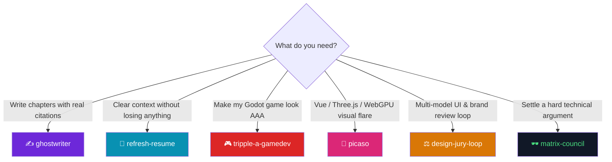
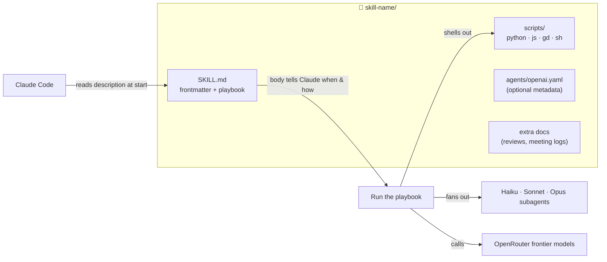
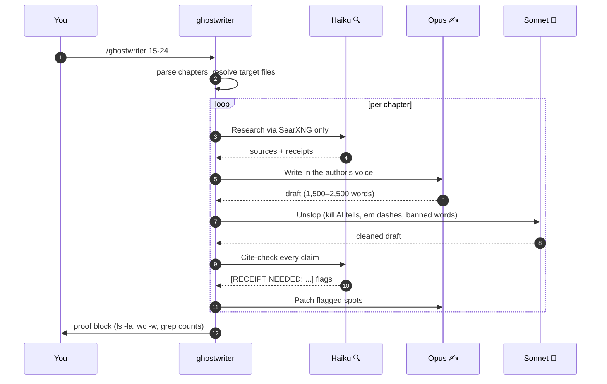
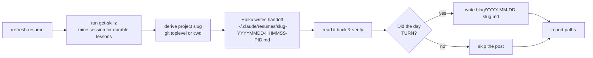
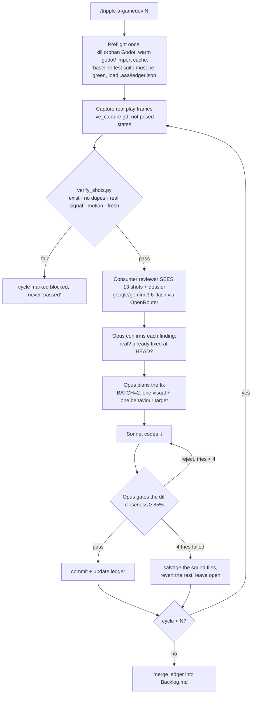
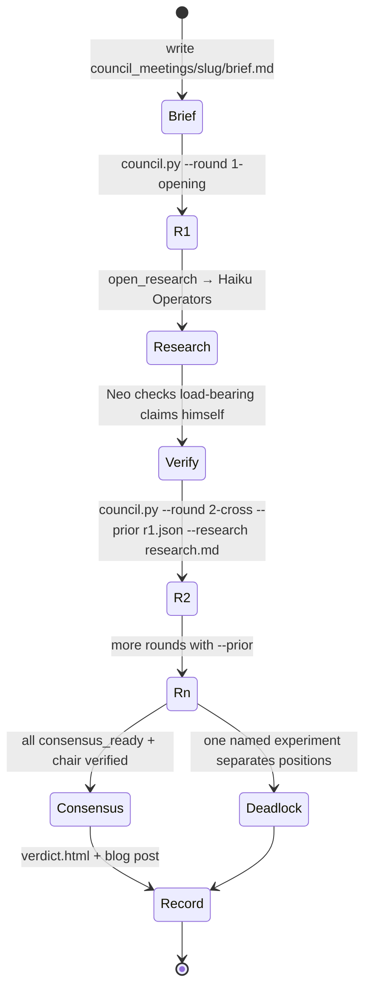
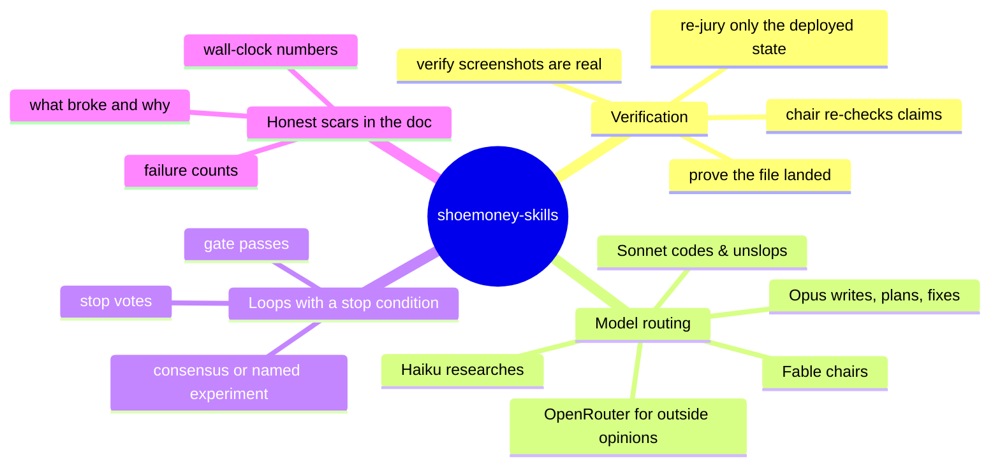
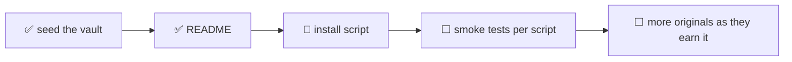

<div align="center">

```
   ▄▄▄        ▄████ ▓█████  ███▄    █ ▄▄▄█████▓  ██████  ██ ▄█▀ ██▓ ██▓     ██▓      ██████
  ▒████▄     ██▒ ▀█▒▓█   ▀  ██ ▀█   █ ▓  ██▒ ▓▒▒██    ▒  ██▄█▒ ▓██▒▓██▒    ▓██▒    ▒██    ▒
  ▒██  ▀█▄  ▒██░▄▄▄░▒███   ▓██  ▀█ ██▒▒ ▓██░ ▒░░ ▓██▄   ▓███▄░ ▒██▒▒██░    ▒██░    ░ ▓██▄
  ░██▄▄▄▄██ ░▓█  ██▓▒▓█  ▄ ▓██▒  ▐▌██▒░ ▓██▓ ░   ▒   ██▒▓██ █▄ ░██░▒██░    ▒██░      ▒   ██▒
   ▓█   ▓██▒░▒▓███▀▒░▒████▒▒██░   ▓██░  ▒██▒ ░ ▒██████▒▒▒██▒ █▄░██░░██████▒░██████▒▒██████▒▒
```

# 🧠 shoemoney-skills

**The keeper vault.** Six original, battle-tested Claude Code skills — the ones that earned a permanent home.

[](#-the-skills)
[](#-the-skills)
[](#-prerequisites)
[](#-prerequisites)
[](#-cross-platform)
[](https://github.com/shoemoney/shoemoney-skills) [](https://git.shoemoney.ai/shoemoney/shoemoney-skills)

*Ghostwrite a book. Reset your context. Ship a AAA-looking game. Turn the flare to 11. Convene a jury. Summon the council.*

</div>

---

## 🗺️ Table of contents

<table>
<tr>
<td>

- [✨ What is this?](#-what-is-this)
- [🧭 Pick a skill](#-pick-a-skill)
- [📦 Install](#-install)
- [🔑 Prerequisites](#-prerequisites)
- [🏗️ How a skill is built](#️-how-a-skill-is-built)

</td>
<td>

- [🎯 The skills](#-the-skills)
  - [✍️ ghostwriter](#️-ghostwriter)
  - [🔄 refresh-resume](#-refresh-resume)
  - [🎮 tripple-a-gamedev](#-tripple-a-gamedev)
  - [🎨 picaso](#-picaso)
  - [⚖️ design-jury-loop](#️-design-jury-loop)
  - [🕶️ matrix-council](#️-matrix-council)

</td>
<td>

- [🔗 Shared patterns](#-shared-patterns)
- [🖥️ Cross-platform](#️-cross-platform)
- [🛣️ Roadmap](#️-roadmap)
- [🤝 Contributing](#-contributing)
- [📜 License](#-license)

</td>
</tr>
</table>

---

## ✨ What is this?

A **Claude Code skill** is a folder with a `SKILL.md` in it. Claude reads the frontmatter to decide *when* to use it, then follows the body as a playbook. Add scripts, and the skill can shell out to real tools instead of guessing.

This repo is the curated cut: **six skills that get used for real work every week**, not a dump of everything ever written. Each one lives in its own folder and can be installed on its own.

| 🔥 Why these six | |
|---|---|
| **They're original** | Written from scratch for this workflow, not forked from a marketplace. |
| **They're measured** | Each `SKILL.md` carries the scars: wall-clock timings, failure counts, what broke and why. |
| **They're loops, not one-shots** | Four of six run *review → fix → verify → repeat* until an independent judge says stop. |
| **They fan out** | Haiku researches, Sonnet codes, Opus reviews, Fable plans. Frontier models via OpenRouter argue with each other. |

---

## 🧭 Pick a skill



| Skill | One-liner | Trigger | Needs API key? | Loops? |
|---|---|---|---|---|
| ✍️ [`ghostwriter`](#️-ghostwriter) | Research → write → cite-check book chapters in your voice | `/ghostwriter 15-24` | ❌ (Claude only + SearXNG) | per chapter |
| 🔄 [`refresh-resume`](#-refresh-resume) | Harvest lessons into skills, write a handoff, then `/clear` safely | `/refresh-resume` | ❌ | ❌ |
| 🎮 [`tripple-a-gamedev`](#-tripple-a-gamedev) | Consumer-persona reviewer *sees* your game, Opus fixes it, gate, repeat | `/tripple-a-gamedev 5` | ✅ OpenRouter | ✅ N cycles |
| 🎨 [`picaso`](#-picaso) | Maximalist Vue / Three.js / WebGPU interaction designer persona | `$picaso` / "Picaso" | ❌ | ❌ |
| ⚖️ [`design-jury-loop`](#️-design-jury-loop) | 5 frontier models critique a live UI, dedupe, implement, ship, repeat | `/design-jury-loop 3` | ✅ OpenRouter | ✅ N rounds |
| 🕶️ [`matrix-council`](#️-matrix-council) | Six models debate + Fable chairs; every claim labelled and verified | `/matrix-council` | ✅ OpenRouter | ✅ up to ~5 rounds |

---

## 📦 Install

Claude Code discovers skills in two places: **`~/.claude/skills/<name>/`** (global, every project) and **`<repo>/.claude/skills/<name>/`** (project-local). Each folder in this repo is a complete skill, so installing is just getting the folder there.

### Option A — clone once, symlink what you want (recommended ⭐)

Symlinks mean `git pull` updates every installed skill in place.

```bash
git clone https://github.com/shoemoney/shoemoney-skills.git ~/Projects/shoemoney-skills
# or from the Forgejo mirror: git clone https://git.shoemoney.ai/shoemoney/shoemoney-skills.git ~/Projects/shoemoney-skills

mkdir -p ~/.claude/skills
for s in ghostwriter refresh-resume tripple-a-gamedev picaso design-jury-loop matrix-council; do
  ln -sfn ~/Projects/shoemoney-skills/$s ~/.claude/skills/$s
done
```

### Option B — install all of them, globally

```bash
git clone https://github.com/shoemoney/shoemoney-skills.git ~/Projects/shoemoney-skills
ln -sfn ~/Projects/shoemoney-skills/* ~/.claude/skills/
```

### Option C — just one skill, copied, project-local

```bash
mkdir -p .claude/skills
cp -R ~/Projects/shoemoney-skills/matrix-council .claude/skills/
```

### Option D — the `~/.agents/skills` convention 🤖

If you keep skills in `~/.agents/skills/` so other agent CLIs (Codex etc.) can find them too, point the Claude symlink at that:

```bash
cp -R ~/Projects/shoemoney-skills/picaso ~/.agents/skills/picaso
ln -sfn ~/.agents/skills/picaso ~/.claude/skills/picaso
```

`picaso/agents/openai.yaml` is the metadata file that convention reads (display name, short description, default prompt).

### ✅ Verify

Start a new Claude Code session and type `/` — the skill names should autocomplete. Or ask: *"what skills do you have installed?"*

<details>
<summary>🩺 Troubleshooting</summary>

| Symptom | Fix |
|---|---|
| Skill doesn't show up | Frontmatter `name:` must match the folder name. Restart the session; skills load at start. |
| `/tripple-a-gamedev` runs but the reviewer script fails to import `or_call` | It needs the shared OpenRouter helper from the `shoop` skill at `~/.claude/skills/shoop/scripts/or_call.py`. See [Prerequisites](#-prerequisites). |
| OpenRouter calls return `"User not found"` | Stale `OPENROUTER_API_KEY` in your shell. The scripts prefer the aigate vault (`~/.claude/aigate/env`); rotate the key there. |
| Reasoning model returns empty content | `max_tokens` too low. `matrix-council` defaults to 12000 on purpose. Don't lower it. |

</details>

---

## 🔑 Prerequisites

| Requirement | Needed by | Notes |
|---|---|---|
| **Claude Code** with the `Workflow` and `Agent` tools | all | The loops fan out subagents; `ghostwriter` and `tripple-a-gamedev` dispatch a `Workflow` script. |
| **Python 3.11+** | `tripple-a-gamedev`, `design-jury-loop`, `matrix-council` | Stdlib only, except `Pillow` for screenshot verification in `tripple-a-gamedev`. |
| **Node 20+** | `tripple-a-gamedev` | `wf_aaa.js` is the Workflow script; `render_prompts.js` builds reviewer prompts. |
| **OpenRouter API key** | `tripple-a-gamedev`, `design-jury-loop`, `matrix-council` | Read from `OPENROUTER_API_KEY`, `~/.config/openrouter/key`, or the aigate vault at `~/.claude/aigate/env` (checked first). |
| **`or_call.py`** from the `shoop` skill | `tripple-a-gamedev` | Shared OpenRouter chat helper. The scripts look in `~/.claude/skills/shoop/scripts/`. |
| **SearXNG MCP server** | `ghostwriter`, `matrix-council` | All web research goes through `mcp__searxng__searxng_web_search` and `web_url_read`. Never the generic WebSearch tool. |
| **Godot 4.x** + the `godot` MCP servers | `tripple-a-gamedev` | Screenshots are captured from the real running game. |
| **Playwright MCP** | `design-jury-loop` | For screenshot briefs when running a vision jury. |
| **git** | `refresh-resume`, `design-jury-loop`, `tripple-a-gamedev`, `matrix-council` | Loops commit their own work; resume slugs come from the repo name. |

---

## 🏗️ How a skill is built



**Anatomy of the frontmatter** (the only part Claude reads before deciding to use the skill):

```yaml
---
name: matrix-council            # must match the folder name
description: >
  Convene a seven-member council ... Use when the user says "/matrix-council" ...
---
```

The `description` is doing the routing. It says what the skill does **and** every phrase that should trigger it. That's why they're long.

---

## 🎯 The skills

### ✍️ ghostwriter

> **Writes book chapters into `manuscript/` with verified citations, in the author's voice, and proves the file landed.**

📁 `ghostwriter/` · 1 file · 224 lines

#### What it does

Dispatches a five-phase `Workflow` per chapter. Nothing is written by one model in one pass; each phase has a different model and a different job.



#### How to use it

| Command | Effect |
|---|---|
| `/ghostwriter Ch. 12` or `/ghostwriter 12` | one chapter |
| `/ghostwriter 15-24` or `/ghostwriter 15,16,19` | a range or list |
| `/ghostwriter BATCH: Ch. 25-40 [direction]` | batch with an editorial note |
| `/ghostwriter retrofit 1-24` | add epigraph, hook, humor, first-person failures to old chapters |
| `/ghostwriter unslop 1-14` | unslop pass only, no rewrite |

#### Guarantees it enforces

- 🚫 **Never invents sources, dates, quotes, or URLs.** Gaps are flagged `[RECEIPT NEEDED: ...]`, never filled in.
- 🚫 **Zero em dashes.** After unslop, `grep -c "—"` must return 0.
- 📏 **Proof or it didn't happen.** Success requires `ls -la`, `wc -w`, `grep -c "RECEIPT NEEDED"` output. mtime newer than the run start, at least 1,200 words, file starts with `# `.
- 🎙️ **Voice cloned from samples**, not described: bottom line first, short paragraphs, the author is the idiot in every failure story.
- 🕹️ **Era layer:** 2 to 4 references from the 1995–2005 internet per chapter, era-accurate only.

<details>
<summary>📐 Chapter structure it produces</summary>

```
# Title
> epigraph (sourced)
hook
**Bottom line:** thesis
## When it bites
## The pattern
## One worked example      ← real, dated
## The quiet failure
## Do / don't
## Where this sits in the book
## Sources and receipts    ← Verified + Gaps
```

</details>

<details>
<summary>⚙️ Paths it expects (project-specific, edit for your book)</summary>

The playbook is wired to a specific manuscript layout: a `manuscript/` target dir, `00-SPINE.md` for chapter titles, `CHAPTER-BRIEFS.md` for per-chapter briefs, and four voice-sample chapters it imitates. To reuse for another book, change those paths in `SKILL.md` and give it your own voice samples.

</details>

---

### 🔄 refresh-resume

> **Three artifacts for three audiences before you `/clear`: skills (what transfers), a resume (what's true right now), and, rarely, a blog post (what happened and why).**

📁 `refresh-resume/` · 1 file · 121 lines

#### What it does



The resume file contains: what's being worked on, current status split into done / in progress / blocked, key decisions and why, open items in priority order, hard facts (paths, model IDs, exact commands, failure modes), and the exact first command to run next time.

#### How to use it

| Say | Result |
|---|---|
| `/refresh-resume` | full pass: skills + resume + maybe blog |
| "dump the context" / "save a resume so I can clear" | same |
| "write up the story so far" | the blog branch, held to the bar below |

Then `/clear`, and in the next session run **`/pickup`** (companion skill) to load the newest resume.

#### Rules baked in

- 📂 **Append-only.** Never deletes or overwrites anything in `~/.claude/resumes/`. One timestamped file per run, so parallel sessions can't collide.
- 🐚 **PID gotcha:** uses `${BASHPID:-$$}` because zsh has no `$BASHPID`. A file ending in `-.md` means the collision guard silently failed.
- 📰 **The bar for a blog post is a TURN, not activity.** A belief killed by measurement, a fix that broke something invisible, a retraction, the moment the question changed. Shipping features is not a turn. Most days don't qualify, and writing one anyway buries the days that do.
- 🔢 Posts keep the wrong turns in and use real numbers ("282x slower", "$0.03 saved").

---

### 🎮 tripple-a-gamedev

> **"Would a shopper believe a AAA studio made this?" A consumer-persona reviewer looks at real screenshots of your Godot game, names the giveaways, Opus fixes them, a gate checks the fix, repeat N times.**

📁 `tripple-a-gamedev/` · 12 files · 1,821-line playbook · 9 scripts

#### What it does

The game is judged **for its kind**: a 2D action game is measured against Dead Cells, not Call of Duty. The reviewer is a multimodal model that *sees* verified real captures, never a blank frame.



Every cycle also runs `difficulty_probe.gd`, a headless sim stepper (about 7,000 ticks/s) that reports pacing as a **median** across seeds, so one pathological seed can't skew the verdict.

#### How to use it

| Command | Effect |
|---|---|
| `/tripple-a-gamedev` | one cycle |
| `/tripple-a-gamedev 5` | five cycles |
| `/aaa-game 3` | alias |
| "what gives away that this isn't AAA?" | one review, no fix loop |

Workflow args (when dispatching `wf_aaa.js` directly): `root` (Godot project, required), `cycles` (1), `batch` (2), `live` (true), `godot` (defaults to the macOS app binary), `reviewModel` (defaults to the script's `google/gemini-3.6-flash`), `maxTries` (4).

⏱️ **Budget honestly.** A measured `/tripple-a-gamedev 5` run took **21.5 hours wall-clock** (88 agents, 0 errors, 5/5 cycles landed). One cycle is about 4.3 hours: review 25s, plan 2m, code 8 to 15m, gate 15m, and about 45m of capture and repro. Twenty cycles is 12 to 20 hours of unattended work, not an evening. Run it under `/loop` or overnight, and **never run two workflows on the same project root**: both commit, and either's reject path erases the other.

#### What it leaves behind

| Path | What |
|---|---|
| `ROOT/.aaa/` (gitignored) | `ledger.json` (backlog, shipped, dismissed, owner decisions), `shots/`, `pacing.json`, `calibration.json` |
| `ROOT/Backlog.md` | Human-readable merge of the ledger across runs. Shipped items marked RESOLVED with the sha. Owner decisions kept verbatim. |
| `rescue/*` branches | Stash snapshots taken before any destructive reset in the reject path. Preflight lists unmerged ones. |
| one git commit per passed cycle | subject is the giveaway title, body is severity and why |

#### Scripts

| Script | Role |
|---|---|
| `wf_aaa.js` | The `Workflow` script. Orchestrates capture → review → fix → gate per cycle. |
| `aaa_review.py` | Sends verified screenshots + persona prompt to the reviewer model. Standalone runnable. |
| `verify_shots.py` | Proves captures are real, fresh, and non-blank before any model sees them. |
| `test_verify_shots_freshness.py` | Tests for the above, so the guard can't silently rot. |
| `live_capture.gd` | Godot-side capture hook that grabs frames from the running game. |
| `difficulty_probe.gd` | Difficulty telemetry: too easy / too hard / about right. |
| `render_prompts.js` | Builds the reviewer and fixer prompts from templates. |
| `bench_reviewers.py` | Benchmarks candidate reviewer models against each other. |
| `check_doc_drift.sh` | Fails if the playbook and the scripts disagree. |

<details>
<summary>🔬 Hard-won gotchas (each one cost a run)</summary>

- **BATCH stays at 2.** Wider batches tanked gate accept rates (55 to 68% vs 93%) and disabled file-level salvage. Narrower ones starved the behaviour lens and the visual findings got rediscovered forever.
- **A warm but stale `.godot/` cache reviews old pixels.** After any `assets/` merge or worktree copy, re-run `--import`, or the cycle judges artwork that isn't on disk.
- **The ledger rides in the prompt every cycle and grows without bound.** It's capped at serialization (details to 400 chars, entries older than 3 cycles replaced with a pointer to `Backlog.md`). Titles are never truncated because they're the dedupe key. Measured: 169 KB at cycle 6 → 48 KB after the cap.
- **Safe to stop between cycles only.** A mid-cycle kill strands gate findings in the workflow journal. Merge them into the ledger before relaunching.
- **`already_fixed` only sees HEAD.** A fix sitting on an unmerged branch is invisible, so preflight lists unmerged branches by subject and Confirm can search them.
- **Commits are verified by side effect.** HEAD is snapshotted before and after; no movement or dirty files means fail, not "probably fine".
- **Pick the reviewer with `bench_reviewers.py`, not vibes.** Grok was faster but misread pixel fonts; gemini-3.6-flash was 5/5 on the hard set.
- **`check_doc_drift.sh` runs at preflight** and fails the run if the playbook's claims (motion gate, reviewer slug, probe path) disagree with the scripts.

</details>

<details>
<summary>📚 Extra docs in the folder</summary>

`REVIEW-2026-07-26.md` and `REVIEW-2026-07-26-addendum-capture-integrity.md` are the adversarial reviews that shaped the capture-integrity guard. They're kept because the *why* is the useful part.

</details>

---

### 🎨 picaso

> **A JavaScript reactivity and interaction designer whose default intensity is 11/10. Vue.js, Three.js, WebGPU. Ask for flare, get flare.**

📁 `picaso/` · 2 files · persona skill, no scripts

#### What it does

Picaso is a **persona**, not a pipeline. Invoke it and Claude becomes a maximalist front-end designer who ships the build, not a mood board.

| Domain | What Picaso reaches for |
|---|---|
| **Vue.js** | Composition API, composables, refs, computed, watchers, lifecycle, transitions |
| **Three.js** | scene composition, materials, lighting, shader effects, instancing, postprocessing |
| **WebGPU** | compute and render pipelines, WGSL, device-loss handling |
| **Motion** | particles, trails, distortion, bloom, ripples, parallax, dimensional typography, reactive lighting, morphing geometry |
| **Performance** | instancing, batching, reusable buffers, bounded particle pools, adaptive resolution, DPR handling |

#### How to use it

| Say | Result |
|---|---|
| "Picaso, give this dashboard ridiculous flare" | maximalist pass on that surface |
| `$picaso` (Codex-style) | same persona via `agents/openai.yaml` |
| "turn these interactions up to 11" | same |
| "…but keep it subtle" | you must explicitly ask for less; 11 is the default |

#### Non-negotiables it enforces

- ♿ **Accessibility survives the flare.** Decorative layers never intercept clicks, hide focus, or corrupt layout. Keyboard and touch keep working. `prefers-reduced-motion` is respected.
- 📊 **Motion that represents data is wired to real data.** No fake progress bars, no invented metrics.
- 🎯 **Scope stays put.** "Flare up this one component" authorizes an extravagant component, not an app rewrite.
- 📈 **Frame rates are measured, never claimed.** Interactions are actually triggered (hover, focus, scroll, click, route change) before reporting done.

---

### ⚖️ design-jury-loop

> **Five frontier models critique a live UI or brand surface, findings are deduped into `improve.md`, the agreed items get implemented and shipped, then the jury looks again. Repeat until they vote to stop.**

📁 `design-jury-loop/` · 3 files · 621-line playbook · 2 scripts

#### What it does

```mermaid
sequenceDiagram
    autonumber
    participant Y as You
    participant L as design-jury-loop
    participant J as jury.py (5 models ∥)
    participant D as dedupe.py
    participant W as Implement (∥ agents)
    Y->>L: /design-jury-loop 3
    loop round i = 1..N
        L->>L: write brief: brand rules, live URLs, inventory, JSON schema
        L->>J: fan out to 5 models via OpenRouter
        J-->>L: per-model JSON + summary.json (votes)
        L->>D: merge into improve.md, count agreement
        L->>L: auto-YES ≥2 votes, a11y, contrast, palette, trust items
        L->>W: fan out by file ownership; must pass build
        W-->>L: done
        L->>L: git commit "design-jury r$i: …" && push
        L->>L: stop if stop_votes ≥ 3, or queue empty, or i == N
    end
```

#### How to use it

| Say | Iterations |
|---|---|
| `/design-jury-loop` | 3 (default) |
| `/design-jury-loop 5` | 5 |
| "jury loop 2 rounds" | 2 |
| "design jury until clean" | up to 5, stops early on 3 stop-votes |

#### Scripts

| Script | CLI |
|---|---|
| `jury.py` | `jury.py <brief.txt> [--models m1,m2,…] [--out-dir DIR] [--timeout 240] [--max-tokens 6000]` — parallel OpenRouter calls, per-model JSON, `summary.json` with vote counts |
| `dedupe.py` | `dedupe.py <summary.json> <improve.md> [--round N]` — merges findings, buckets by general / transitions / professional / font, counts agreement |

**Default jury:** `anthropic/claude-opus-5` · `openai/gpt-5.6-sol` · `google/gemini-3.7-flash` · `x-ai/grok-4.6` · `deepseek/deepseek-v4-flash`. Override with `--models`.

<details>
<summary>🔬 Hard-won gotchas (measured 2026-08-27)</summary>

- **Round 1 always scores zero stop votes.** Plan for it. Never present R1 as done.
- **Re-jury only the deployed state.** If you jury the local tree, models re-report last round's findings as if nothing shipped. Verify the asset hash moved first.
- **Reasoning models return `content: null`.** Fall back to the `reasoning` field and budget 3000+ tokens.
- **Honest-stop framing works.** The brief must say `stop: true` is expected, respected, and legitimate. Omitting it produced 0/45 stop votes in R1.
- **Vision juries:** downscale to ≤1100×2200 JPEG q78 before base64. Expect training-cutoff false positives about dates. Scroll incrementally; `fullPage` captures skip scroll timelines.
- **Print juries:** HTML → Chrome `--headless=new --print-to-pdf` → `pdftoppm -png -r 110` → per-page PNGs.
- **Plateau while the owner hates it?** The brief's "do not reopen" rule is the culprit. Unlock it and ask for a diagnosis of the gap first.

</details>

---

### 🕶️ matrix-council

> **Seven engineers settle a hard question with evidence: six frontier models debate over OpenRouter, Fable chairs as Neo with tool access, Haiku Operators fetch what nobody knows first-hand. Every claim is labelled. Theories must ship their own test. Members retract on proof.**

📁 `matrix-council/` · 3 files · 225-line playbook · 1 script

#### The seat map

| Seat | Model | Role |
|---|---|---|
| 🕶️ **Neo** (chair) | Fable, in this harness | Verifies independently from repo, DB, and artifacts. Casting vote requires evidence. |
| Morpheus | `openai/gpt-5.6-luna-pro` | member |
| Trinity | `google/gemini-3.6-flash` | member |
| Mouse | `x-ai/grok-4.5` | member |
| Tank | `deepseek/deepseek-v4-flash` | member |
| Seraph | `moonshotai/kimi-k3` | member |
| Niobe | `qwen/qwen3.8-max` | member (can starve on heavy briefs; treat as absent, not as a vote) |
| 📡 **Operators** | Haiku subagents | research on demand, SearXNG only |

#### Claim labels

| Label | Meaning |
|---|---|
| ✅ `VERIFIED` | evidence attached, chair re-checked it |
| ⚔️ `CONTESTED` | members disagree, evidence on both sides |
| 💭 `THEORY` | allowed, **but must name the test that would settle it** |
| 📏 `UNMEASURED` | nobody has the number yet |

#### How a session runs



#### How to use it

| Say | Result |
|---|---|
| `/matrix-council` | convene on the question at hand |
| "convene the council" / "ask the council" / "council of SWE" | same |

```bash
python3 scripts/council.py <brief.md> --round <name> --out-dir council_meetings/<slug> \
  [--members <list>] [--prior <json>] [--research <md>] [--max-tokens 12000]
```

#### Outputs

- 📄 `council_meetings/<slug>/verdict.html` — self-contained meeting record: claims table, retractions, dissent, still-open items, per-member positions, chair's independent verification.
- 📰 `blog/<YYYY-MM-DD>-<slug>.md` — narrative for humans, wrong turns included, real numbers with sample sizes.

<details>
<summary>⚠️ Rules that make it work</summary>

- **`--max-tokens 12000` is measured, not arbitrary.** Reasoning models spend the budget thinking *before* emitting content. Lower it and they return empty at `finish_reason=length`. This is the number one failure.
- **Unanimous consensus without chair verification is a poll, not proof.** Neo must independently check every load-bearing `VERIFIED` claim.
- **Casting vote requires evidence.** If the chair can't break a tie with repo or DB findings, declare productive deadlock and name the experiment.
- **Cap at about 5 rounds.** Unconverged after that means the question was underspecified.

</details>

---

## 🔗 Shared patterns

These skills rhyme on purpose.



| Pattern | Where |
|---|---|
| **Web research goes through SearXNG MCP only** | ghostwriter, matrix-council |
| **OpenRouter key from the aigate vault first, env second** | tripple-a-gamedev, design-jury-loop, matrix-council |
| **JSON out of models, extracted defensively** | jury.py, council.py, aaa_review.py |
| **Never claim done without shell proof** | ghostwriter, refresh-resume, tripple-a-gamedev, picaso |
| **Commit after each round** | design-jury-loop, tripple-a-gamedev |

---

## 🖥️ Cross-platform

| | macOS 🍎 | Linux 🐧 | Windows 🪟 |
|---|---|---|---|
| ghostwriter | ✅ | ✅ | ✅ |
| refresh-resume | ✅ (zsh PID fallback built in) | ✅ | ⚠️ needs a POSIX shell |
| tripple-a-gamedev | ✅ used here | ✅ should work | ❓ untested (Godot capture hooks are engine-side, so likely fine) |
| picaso | ✅ | ✅ | ✅ |
| design-jury-loop | ✅ used here | ✅ | ⚠️ print-jury pipeline assumes `pdftoppm` |
| matrix-council | ✅ used here | ✅ | ✅ (python3 only) |

---

## 🛣️ Roadmap



| Status | Item |
|---|---|
| ✅ | Six skills in their own folders, pushed |
| ✅ | This README |
| 🔨 | `install.sh` that does Option A for you |
| ⬜ | CI: run `test_verify_shots_freshness.py` and a `--dry-run` of `jury.py` / `council.py` |
| ⬜ | Vendor `or_call.py` so `tripple-a-gamedev` stops depending on `shoop` |
| ⬜ | New skills get added only after they've been used on real work more than once |

---

## 🤝 Contributing

This is a personal vault, but PRs are welcome if you have actually run the skill.

1. Fork on [GitHub](https://github.com/shoemoney/shoemoney-skills). The Forgejo copy at git.shoemoney.ai is a mirror.
2. One skill per folder. `name:` in frontmatter must equal the folder name.
3. If you change a script's CLI, update the table in this README **in the same commit**. Stale docs are instructions to build the wrong thing.
4. Conventional commits with emoji: `feat: 🎮 …`, `fix: ⚖️ …`, `docs: 📖 …`.

---

## 📜 License

MIT. Take what's useful. The scars are free.

---

<div align="center">

**Six skills. Zero fluff. All of them have been run at 3am.** 🌙

*If a skill in here lied to you, the fix is a PR to `SKILL.md`, not a note in your head.*

</div>
