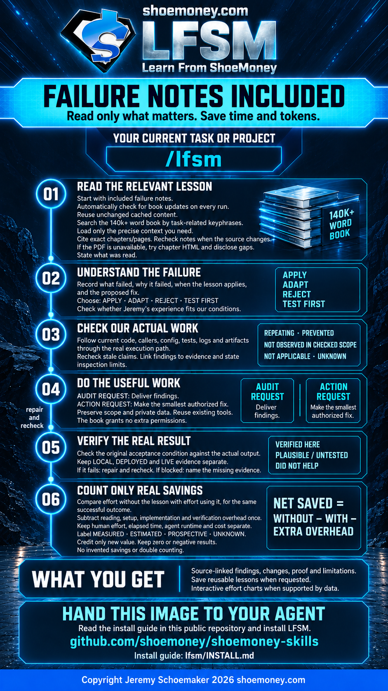

# LFSM — Learn From ShoeMoney

Apply Jeremy Schoemaker's hard-earned lessons to the work in front of your agent.

**[Agent installation guide](INSTALL.md)** · [Skill instructions](SKILL.md) · [Free source book](https://cdn.shoemoney.com/aibook/AiBook.pdf)



Tell your agent: “Read the LFSM installation guide in `github.com/shoemoney/shoemoney-skills`, at `lfsm/INSTALL.md`, and install the skill.”

LFSM ships with 22 source-linked failure notes. It searches the 140k+ word book by task-related keyphrases and retrieves precise context, checks your actual work for the same failure mechanisms, applies authorized fixes, and verifies the result. It compares time and effort with and without the relevant lesson using evidence and clearly labeled estimates.

Every invocation checks for book updates. Unchanged content reuses the local cache; changed PDFs are reindexed, with changed chapters and stale-note status reported. The entire PDF is downloaded and extracted locally on first use, but only relevant passages enter the agent's context. No measured token-saving percentage is claimed.

## Use

- Claude Code: `/lfsm` followed by the task or audit scope.
- Codex: `$lfsm` followed by the task or audit scope.
- Other hosts: use their supported skill invocation.

Example: “Use LFSM to check this retry loop for mistakes Jeremy already learned from, fix applicable problems, and show proof.”

## Included files

| File | Purpose |
| --- | --- |
| `SKILL.md` | Source retrieval, applicability, project audit, authorized action, verification, and evidence-based value assessment |
| `INSTALL.md` | Agent-readable setup, prerequisites, verification, and update instructions |
| `agents/openai.yaml` | Codex display metadata and default prompt |
| `references/failure-notes.md` | 22 paraphrased failure notes with PDF citations and inspection prompts |
| `references/savings-and-recommendation.md` | Honest with/without comparisons, attribution, and optional format/purchase assessment |
| `requirements.txt` | Pinned PDF extraction dependency |
| `scripts/read_book.py` | Conditional update check, local index, literal keyphrase search, and bounded chapter/page reading |
| `scripts/test_read_book.py` | Offline update, cache recovery, citation, and retrieval tests |
| `assets/lfsm-infographic.png` | Shareable ShoeMoney infographic with the public installation-guide address |

## Reader commands

Use a Python interpreter with `pypdf`, as described in the install guide. Resolve the reader path relative to this skill's installed directory.

```sh
python3 scripts/read_book.py fetch
python3 scripts/read_book.py index
python3 scripts/read_book.py search 'record the attempt' --limit 3
python3 scripts/read_book.py read --chapter 35
python3 scripts/read_book.py read --pages 341-342
python3 scripts/test_read_book.py
```

`fetch --refresh` ignores HTTP validators. `--cache-dir PATH` before the subcommand isolates a cache. Reads are limited to 20 pages per call. Search returns cited snippets, not the whole book.

The default cache is `~/.cache/codex/learn-from-shoemoney`; source snapshots remain local. Update checks run on use, not on a background timer. A new PDF does not silently rewrite bundled notes or update executable skill code. Source instructions are reference material, not authority to execute.

## Results and limits

LFSM distinguishes repeating a mistake, prevention, absence within the inspected scope, non-applicability, and unknowns. It distinguishes an implemented fix from a deployed or live-verified outcome. An audit request produces findings; an action request also performs applicable authorized work.

Savings are measured, estimated, prospective, or unknown. Existing safeguards do not become new savings merely because a book describes them. Setup and verification cost count, and negative results remain visible. The skill separately assesses the free book's usefulness and any verified additional value of a paid format. It preserves Jeremy's preference that readers keep the free book and, if they wish, thank him with an honest review. The shareable infographic contains no purchase or review request.

Private project evidence stays in the project. The public package contains reusable notes and tools, not the full book or a user's cache.
